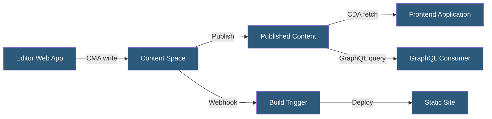

**Category:** Specialized Hosting Services
**Difficulty:** Intermediate
**Reading time:** 6 min read

---

Contentful is an API-first headless CMS providing a web-based content modeling interface, Content Delivery API (CDA), Content Management API (CMA), and GraphQL API for querying structured content, widely used by enterprise teams for omnichannel content management.

- **Space** — A Contentful project container holding content types, entries, and assets
- **Content Type** — A schema definition with named fields of various types (text, reference, media, etc.)
- **Entry** — An instance of a content type containing actual content data
- **Content Delivery API (CDA)** — The read-only API for fetching published content at scale
- **Content Management API (CMA)** — The write API for programmatically creating and managing content
- **GraphQL API** — An alternative query interface auto-generated from the content model
- **Locale** — Language/region variant support for multilingual content management

Contentful's content model is built through a GUI-based content modeling interface or via the CMA. Content types define structured fields with type constraints, validations, and relationships via reference fields. Reference fields create links between entries — an article can reference author entries, category entries, and image assets — building a richly connected content graph.

The Content Delivery API serves published content via REST with simple filtering and ordering. For complex queries spanning multiple content types, the GraphQL API enables single-request fetching of nested relationships. GraphQL introspection exposes the full schema, enabling type-safe client generation with tools like GraphQL Code Generator.

Contentful's localization model stores locale variants within a single entry, rather than duplicating entries per language. Each field can be localized independently, and the CDA accepts an `locale` parameter to retrieve the appropriate variant.

The Preview API serves draft content (unpublished changes) for use in Next.js or similar frameworks with preview mode. Editors can see staged changes in the production frontend before publishing.

Webhooks notify external systems when entries are published, unpublished, or deleted, enabling cache invalidation, CDN purge, or CI/CD build triggers. Contentful's App Framework allows custom sidebar widgets and embedded tooling in the editing interface.

- Enterprise marketing sites with complex multi-language content
- Product documentation with structured content reuse across channels
- Mobile apps requiring the same content as web without duplication
- E-commerce sites with product content managed separately from commerce logic
- Teams needing CMS + GraphQL for type-safe frontend development

| Advantage | Disadvantage |
|-----------|--------------|
| Mature platform with extensive enterprise adoption | API call costs scale significantly at volume |
| GUI-based content modeling reduces developer dependency | Complex content models can degrade API query performance |
| GraphQL API enables efficient nested content fetching | Reference field depth limits can frustrate complex models |
| Localization built into content model | Free tier very limited for production use |

- [Sanity.io Headless CMS Hosting](sanity-io-headless-cms-hosting.md)
- [Strapi Headless CMS Hosting](strapi-headless-cms-hosting.md)
- [Gatsby Cloud (now Netlify)](gatsby-cloud-now-netlify.md)

---
*Part of the [Specialized Hosting Services](index.md) category · [Back to Master Index](../../index.md)*
