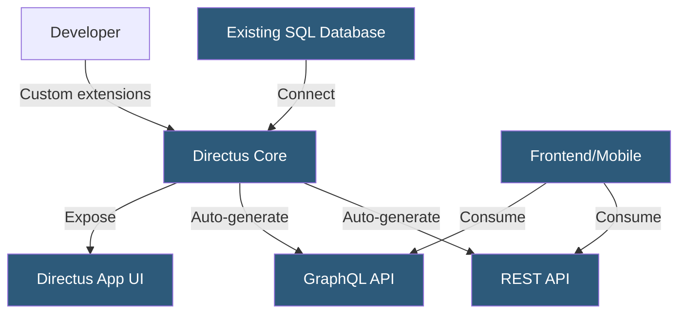

**Category:** Specialized Hosting Services
**Difficulty:** Intermediate
**Reading time:** 6 min read

---

Directus is an open-source data platform that wraps any existing SQL database with a REST and GraphQL API, a no-code data management app, and a real-time WebSocket interface — functioning as both a headless CMS and a backend-as-a-service for custom applications.

- **Collections** — SQL database tables exposed through the Directus API and admin app
- **Fields** — Database columns managed through Directus with type-specific UI and validation
- **Directus App** — The web-based admin interface for managing data, users, and roles
- **Data Studio** — Directus's term for its visual data management experience
- **Flows** — Directus's built-in automation engine for event-driven workflows
- **Extensions** — Custom interfaces, endpoints, hooks, and display components
- **Bring Your Own Database (BYOD)** — Directus connects to an existing database rather than creating its own schema

Directus introspects an existing database schema — PostgreSQL, MySQL, SQLite, MariaDB, MS SQL, or OracleDB — and dynamically builds a REST and GraphQL API matching the table structure. Unlike traditional CMSes that force a prescribed schema, Directus adapts to any existing data model, making it practical for adding a management interface to legacy systems or production databases.

The Directus App provides a spreadsheet-like interface for data management, with column types determining the UI control used for each field. A JSON column presents a code editor; a boolean column shows a toggle; a foreign key reference shows a relational picker. Custom interface extensions replace default controls with specialized UIs.

Role-based permissions in Directus are table and column-level, not just route-level. A role can have read access to specific columns within a collection while being blocked from others. Row-level permissions filter query results based on user attributes — a company's employees can only see rows matching their company ID.

Flows replace external webhook processors by building event-driven automation within Directus. A flow can trigger on item creation, schedule via cron, or receive an HTTP webhook, then chain operations: send email, call an external API, transform data, or create related records.

Directus Cloud provides managed hosting, while the open-source self-hosted version runs as a Node.js application deployable to any containerized environment.

- Adding an admin interface to an existing production database without schema changes
- Backend-as-a-service for mobile applications needing authenticated data APIs
- Content management for applications with complex relational data structures
- Internal tools and dashboards for non-technical data management
- Replacing custom admin panels with a configurable no-code alternative

| Advantage | Disadvantage |
|-----------|--------------|
| Works with any existing SQL database without schema migration | Complex permission model requires careful configuration |
| Both REST and GraphQL APIs auto-generated | Real-time subscriptions require additional infrastructure setup |
| No-code Flows reduce need for external automation tools | Self-hosting requires Node.js deployment expertise |
| Column-level permissions enable fine-grained data access control | Admin app UX can be challenging for non-technical editors |

- [Strapi Headless CMS Hosting](strapi-headless-cms-hosting.md)
- [Contentful Headless CMS](contentful-headless-cms.md)
- [Sanity.io Headless CMS Hosting](sanity-io-headless-cms-hosting.md)

---
*Part of the [Specialized Hosting Services](index.md) category · [Back to Master Index](../../index.md)*
