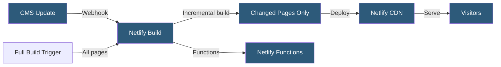

**Category:** Specialized Hosting Services
**Difficulty:** Intermediate
**Reading time:** 6 min read

---

Gatsby Cloud was a specialized build and hosting platform for Gatsby React-based sites offering incremental builds, CMS preview, and CDN deployment. It was acquired by Netlify in 2023 and its capabilities merged into the Netlify platform, making Netlify the primary deployment target for Gatsby projects.

- **Gatsby Framework** — A React-based static site generator with GraphQL data layer and plugin ecosystem
- **Incremental Builds** — Building only the pages affected by a content change rather than the entire site
- **Deferred Static Generation (DSG)** — Generating page HTML on first request and caching, deferring build-time generation
- **Content Sync** — Webhook-triggered rebuild when connected CMS content changes
- **Gatsby Functions** — Serverless functions deployed alongside static pages for API-like functionality
- **Netlify Integration** — Gatsby's current deployment through Netlify's build and CDN infrastructure
- **Gatsby Image API** — Automated image optimization, lazy loading, and responsive image generation at build time

Gatsby generates static HTML at build time using a React component model with a GraphQL data layer. Source plugins fetch content from CMSes, APIs, and local files; transformer plugins convert raw data into node types; and page templates query nodes to produce HTML files.

The most performance-critical feature for large sites was incremental builds — tracking the dependency graph of which pages depend on which content nodes, and rebuilding only affected pages when content changes. A site with 50,000 pages that updates one blog post rebuilds that post and its related index pages, not all 50,000.

Deferred Static Generation extends the incremental approach by generating less-popular pages on first request rather than at build time, reducing build time for sites with enormous page counts while ensuring frequently-visited pages are pre-built.

After the Netlify acquisition, Gatsby projects deploy to Netlify's CDN with build minutes drawn from the team's Netlify plan. Gatsby's build cache is preserved between builds to enable incremental builds. Gatsby Cloud's dedicated build infrastructure no longer exists as a separate product.

- Large React-based content sites where full rebuilds are impractically slow
- E-commerce sites with thousands of product pages using deferred generation
- Sites requiring CMS-triggered preview deployments for editors
- Applications combining static pages with serverless API functionality
- Teams already in the React/Gatsby ecosystem deploying to Netlify

| Advantage | Disadvantage |
|-----------|--------------|
| Incremental builds dramatically reduce rebuild times for large sites | Gatsby's build complexity can be challenging for non-React teams |
| GraphQL data layer unifies multi-source content | Slower initial build compared to simpler static generators |
| Gatsby Image provides automatic image optimization | Gatsby Cloud as a separate product no longer exists |
| Deferred generation handles enormous page catalogs | Netlify build minutes can be costly for frequent rebuilds |

- [Gatsby Incremental Builds](gatsby-incremental-builds.md)
- [Sanity.io Headless CMS Hosting](sanity-io-headless-cms-hosting.md)
- [Contentful Headless CMS](contentful-headless-cms.md)

---
*Part of the [Specialized Hosting Services](index.md) category · [Back to Master Index](../../index.md)*
