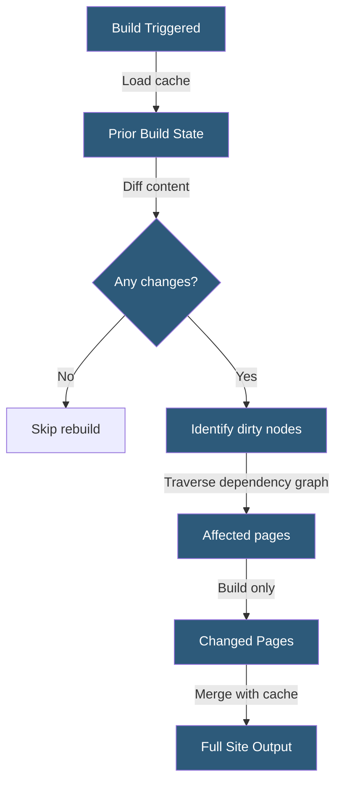

**Category:** Specialized Hosting Services
**Difficulty:** Advanced
**Reading time:** 7 min read

---

Gatsby Incremental Builds is a build optimization technique that tracks the dependency graph between content nodes and generated pages, rebuilding only the pages affected by a content change rather than regenerating the entire site on every update.

- **Build Cache** — Persisted artifacts from prior builds used to skip unchanged work
- **Node Change Detection** — Comparing content nodes between build runs to identify what changed
- **Dependency Graph** — A data structure recording which pages depend on which content nodes
- **Page Invalidation** — Marking a page for rebuild because a dependent node changed
- **Dirty Nodes** — Content nodes identified as added, modified, or deleted since the last build
- **Cache Warming** — The process of loading the prior build's cache before running the current build
- **Full Rebuild** — A build that ignores cache and generates all pages, used for schema changes

Gatsby's build system maintains a state database of all content nodes and their relationships to generated pages. During a build with cache available, Gatsby compares the current content against the stored state to identify dirty nodes — any node that was created, modified, or deleted since the last build.

The dirty node set propagates through the dependency graph. If a blog post node is modified, its individual post page is marked for rebuild. If the post is featured on a homepage query result, the homepage is also marked dirty. If a listing page paginates across all posts, modifying the total count (e.g., adding a new post) marks all paginated listing pages as dirty.

Pages not in the dirty set are served directly from the build cache — their HTML, JavaScript, and CSS are reused verbatim. Gatsby merges rebuilt pages with cached pages into the final output, producing a complete site where only the truly changed portion was re-rendered.

Incremental builds require persistent cache storage between build runs. On CI/CD systems like Netlify, the cache directory is stored and restored automatically. On GitHub Actions or other runners, explicit cache steps using `actions/cache` are required.

Schema changes (adding or removing GraphQL fields, changing plugin configuration) invalidate the entire cache and trigger a full rebuild, since the dependency graph structure may have changed in ways that cannot be incrementally analyzed.

- News or media sites publishing dozens of articles per day
- E-commerce catalogs with frequent price or inventory updates
- Documentation sites where most content is stable but sections are regularly updated
- Marketing sites requiring immediate reflection of CMS edits
- Platforms where build time directly impacts editor feedback loops

| Advantage | Disadvantage |
|-----------|--------------|
| Build time scales with content changes, not site size | Cache invalidation complexity can cause missed rebuilds |
| Sub-minute rebuilds for small content changes on large sites | Schema changes always force full rebuilds |
| Enables CMS preview-on-save workflows for editors | Requires persistent cache storage infrastructure |
| Reduces CI/CD compute costs for frequent content updates | Dependency graph errors can produce stale pages |

- [Gatsby Cloud (now Netlify)](gatsby-cloud-now-netlify.md)
- [Sanity.io Headless CMS Hosting](sanity-io-headless-cms-hosting.md)
- [Contentful Headless CMS](contentful-headless-cms.md)

---
*Part of the [Specialized Hosting Services](index.md) category · [Back to Master Index](../../index.md)*
