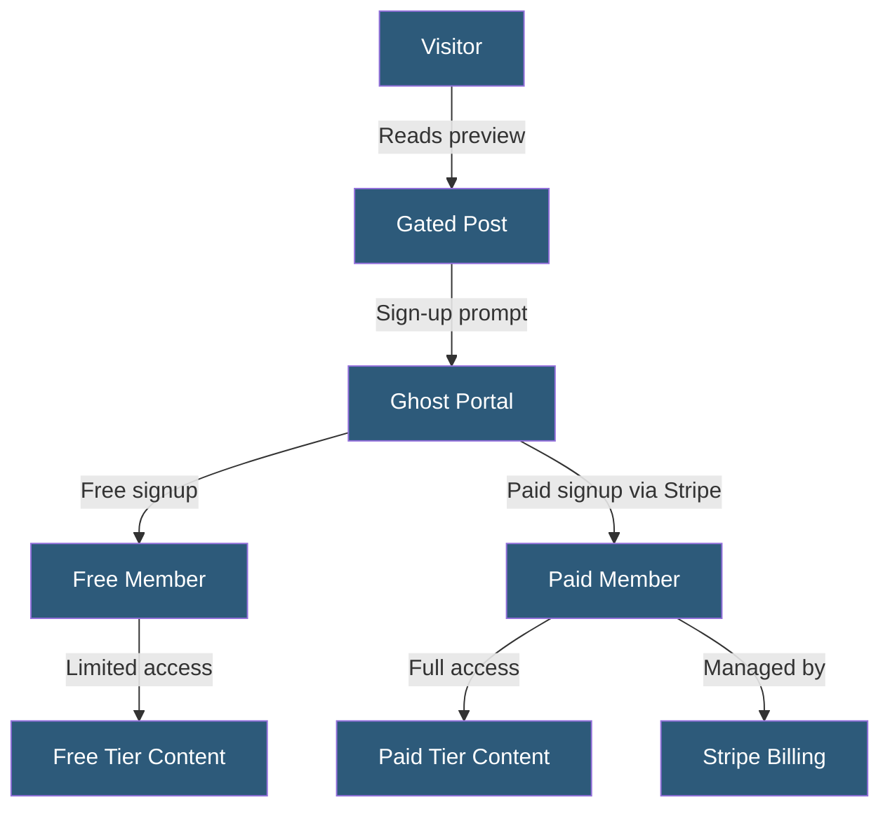

**Category:** Specialized Hosting Services
**Difficulty:** Intermediate
**Reading time:** 6 min read

---

Ghost's membership system enables publishers to gate premium content behind paid subscriptions managed natively within Ghost, integrating Stripe for payment processing without requiring third-party membership plugins or separate subscription platforms.

- **Member** — A contact with an email address who has signed up (free or paid) on a Ghost site
- **Tier** — A subscription level with a defined price and access to specific content
- **Stripe Integration** — Ghost's native payment processing connection for subscription billing
- **Access Level** — A per-post setting controlling which member tiers can read full content
- **Portal** — Ghost's built-in JavaScript widget for sign-up, login, and account management
- **Annual vs Monthly** — Pricing options per tier controlling billing cycle
- **Complimentary Access** — Manually granted paid-tier access without charging a subscription

Ghost's membership system stores member records (email, name, subscription status, tier) in its own database, eliminating the need for a separate CRM for basic subscription management. When a visitor reaches a paywalled post, Ghost's JavaScript Portal widget intercepts the content, shows a preview (configurable number of paragraphs), and presents sign-up or login options.

Payment is handled via Ghost's direct Stripe integration. When a visitor selects a paid tier, they are directed to Stripe Checkout. After successful payment, Stripe notifies Ghost via webhook, which upgrades the member's tier and grants access. Monthly and annual billing options are available per tier, and Ghost handles subscription renewal, cancellation, and upgrade/downgrade flows through Stripe.

Tiers allow multiple price points on a single Ghost site — a free tier, a monthly tier, and an annual tier with a discount. Access levels are set per post: public (anyone can read), members (requires signup), or paid (requires paid tier). This enables a content funnel from free articles through email capture to paid conversion.

The member management interface in Ghost admin shows subscriber lists, import/export, filtered views by tier, and the ability to manually grant complimentary access. Basic email segmentation in newsletters uses tier membership to send exclusive content only to paid subscribers.

- Independent writers monetizing content through paid subscriptions
- Newsletters adding premium tiers with paywalled deep-dives
- Community publications with member-only event announcements
- Researchers sharing free summaries with paid access to full reports
- Organizations building sustainable recurring revenue from content

| Advantage | Disadvantage |
|-----------|--------------|
| Native Stripe integration without third-party plugins | Less sophisticated billing than Chargebee or Recurly |
| Free member tier enables email capture before paid conversion | Minimal analytics on subscriber lifetime value and churn |
| Tiers and access levels fully managed within Ghost | Ghost takes no revenue cut, but Stripe fees apply |
| Complimentary access for grants and partnerships | Limited A/B testing for paywall positioning and copy |

- [Ghost Pro Managed Hosting](ghost-pro-managed-hosting.md)
- [Ghost Newsletter Platform](ghost-newsletter-platform.md)
- [Webflow Hosting Platform](webflow-hosting-platform.md)

---
*Part of the [Specialized Hosting Services](index.md) category · [Back to Master Index](../../index.md)*
