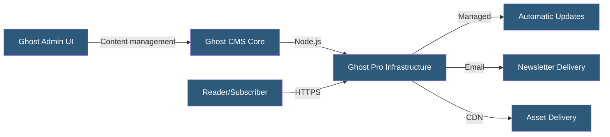

**Category:** Specialized Hosting Services
**Difficulty:** Beginner
**Reading time:** 5 min read

---

Ghost Pro is the official managed hosting service for the Ghost open-source publishing platform, providing pre-configured Ghost instances with automatic updates, managed backups, custom domains, and email newsletter delivery — eliminating self-hosting complexity for writers and publishers.

- **Ghost** — An open-source Node.js publishing platform for blogs, newsletters, and membership sites
- **Ghost Pro** — Ghost Foundation's managed hosting with automatic platform updates
- **Newsletter** — Ghost's built-in email newsletter system tied to site content
- **Membership** — Ghost's native subscription and access control system for premium content
- **Custom Domain** — A user-owned domain pointed at a Ghost Pro instance
- **Staff Users** — Team members with author, editor, or admin roles in the Ghost admin panel
- **Labs Features** — Experimental Ghost features opt-in enabled before general release

Ghost Pro provisions a Ghost instance on the Ghost Foundation's infrastructure. Each instance receives a `.ghost.io` subdomain and can be pointed to a custom domain via DNS CNAME. SSL certificates are provisioned automatically.

Unlike self-hosted Ghost (which requires a Node.js server, database, and email configuration), Ghost Pro handles all infrastructure management: Ghost core updates apply automatically on the configured update track, MySQL database backups occur daily, and email newsletter delivery uses a managed sending service.

The Ghost admin panel provides a clean, distraction-free writing environment with rich text and card-based content blocks, SEO settings per post, and a subscriber management interface. Content is delivered via Ghost's Handlebars-based theming system — themes define the frontend presentation and are installed from the admin panel or uploaded as zip files.

Ghost Pro's pricing tiers are based on monthly active members (email subscribers), making costs predictable for newsletter-focused publications. Custom integrations use Ghost's Content API (read-only) and Admin API (authenticated write access) for headless deployments or third-party tool connections.

- Independent writers and bloggers wanting a professional CMS without server administration
- Newsletter-first publications needing integrated email delivery with content
- Membership sites with free/paid content tiers built natively
- Journalists migrating from WordPress to a cleaner, faster publishing experience
- Developers using Ghost as a headless CMS with the Content API

| Advantage | Disadvantage |
|-----------|--------------|
| Zero infrastructure management — updates handled automatically | Cost scales with member count at growth |
| Native newsletter and membership built into the platform | Less plugin ecosystem than WordPress |
| Fast, lightweight frontend compared to WordPress | Limited template customization for non-developers |
| Financially sustainable hosting from the platform creators | No shared hosting or free tier |

- [Ghost Newsletter Platform](ghost-newsletter-platform.md)
- [Ghost Membership Features](ghost-membership-features.md)
- [Medium-Style Publication Hosting](medium-style-publication-hosting.md)

---
*Part of the [Specialized Hosting Services](index.md) category · [Back to Master Index](../../index.md)*
