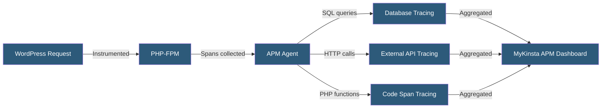

**Category:** Specialized Hosting Services
**Difficulty:** Intermediate
**Reading time:** 6 min read

---

Kinsta APM is a built-in Application Performance Monitoring tool integrated into the MyKinsta dashboard that instruments WordPress PHP execution, surfacing slow transactions, database queries, and external HTTP calls without requiring a separate New Relic or Datadog subscription.

- **Transaction** — A single PHP request execution cycle (page load, AJAX call, REST API request)
- **Slowest Transactions** — A ranked list of requests taking the longest average time to complete
- **Database Query Tracing** — Recording individual SQL queries within a transaction with execution times
- **External HTTP Call Tracing** — Capturing outbound API calls made during PHP execution
- **PHP Span** — A measured segment of PHP function execution time within a transaction
- **Sample Rate** — The percentage of transactions recorded to balance monitoring overhead
- **APM Session** — A time-bounded period during which APM data collection is active

Kinsta APM activates through a toggle in the MyKinsta dashboard under the site's Tools section. Once enabled, a lightweight PHP extension instruments outgoing database connections and HTTP calls, and records function-level execution spans for WordPress requests.

The APM dashboard presents a summary view of the slowest transactions by average duration, total call count, and total time consumed. Clicking into a specific transaction reveals a waterfall timeline breaking down PHP execution into individual spans: WordPress bootstrap, plugin initialization, hook execution, database queries, and external API calls.

Database query tracing shows each SQL statement with its execution time and the calling PHP function, enabling identification of N+1 query patterns — where a loop issues one database query per iteration instead of a single batched query. This is one of the most common WordPress performance anti-patterns.

External HTTP call tracing captures WordPress's `wp_remote_get()` and `wp_remote_post()` calls, revealing when plugins or themes make synchronous outbound API requests that block page rendering. A plugin fetching weather data or exchange rates synchronously can add hundreds of milliseconds per page load.

APM is designed for diagnostic sessions rather than always-on monitoring — enabling it for 1–24 hours while investigating a performance issue, then disabling to eliminate any instrumentation overhead. Historical APM data is retained for the session duration.

- Diagnosing why a specific WordPress page type is unusually slow
- Identifying plugins making synchronous external API calls during page rendering
- Finding N+1 database query patterns in WooCommerce or membership plugins
- Benchmarking performance impact of enabling or disabling specific plugins
- Post-deployment performance validation for major plugin or theme updates

| Advantage | Disadvantage |
|-----------|--------------|
| No separate APM subscription required | Session-based monitoring, not always-on |
| WordPress-specific instrumentation out of the box | Less feature-rich than dedicated APM platforms |
| Database and HTTP call tracing per transaction | Limited historical data retention |
| Accessible to non-APM experts through MyKinsta UI | Does not support custom span instrumentation in application code |

- [Kinsta WordPress Hosting](kinsta-wordpress-hosting.md)
- [Kinsta CDN and Edge Caching](kinsta-cdn-and-edge-caching.md)
- [WP Engine Page Performance](wp-engine-page-performance.md)

---
*Part of the [Specialized Hosting Services](index.md) category · [Back to Master Index](../../index.md)*
