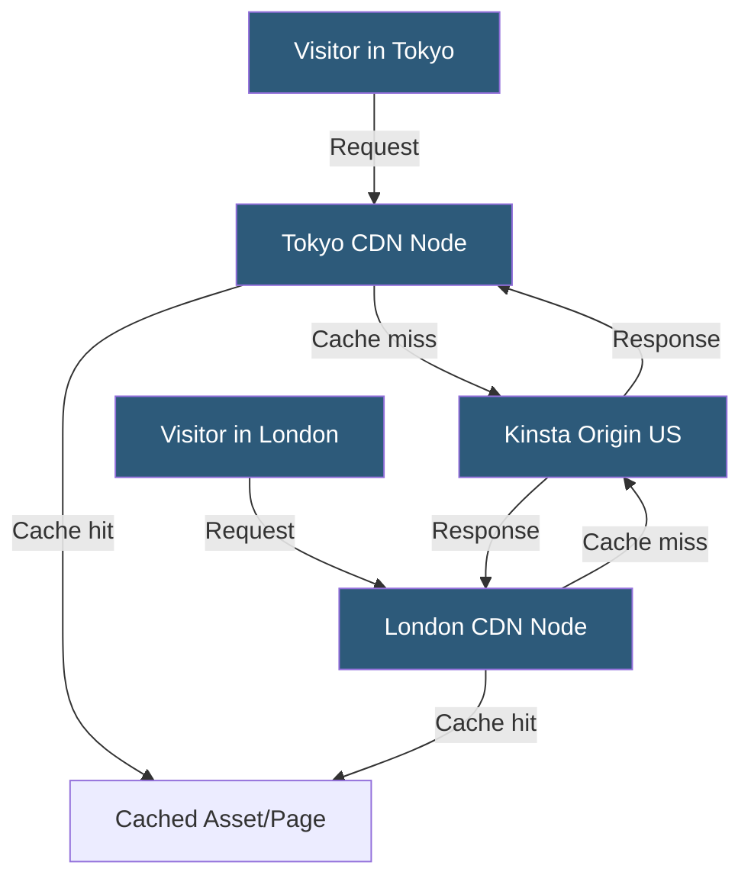

**Category:** Specialized Hosting Services
**Difficulty:** Intermediate
**Reading time:** 6 min read

---

Kinsta's CDN is powered by Cloudflare's network, distributing static assets and optionally full HTML pages from 260+ edge locations globally. Edge caching moves the full-page cache from Kinsta's origin servers to CDN nodes, delivering WordPress pages with sub-100ms response times to global visitors.

- **Cloudflare Network** — The underlying CDN infrastructure with 260+ global points of presence
- **Static Asset CDN** — Serving CSS, JavaScript, images, and fonts from edge nodes close to visitors
- **Edge Caching** — Storing full HTML page responses at CDN edge nodes for ultra-fast delivery
- **Cache-Control Header** — HTTP header instructing CDN nodes how long to cache a response
- **Purge** — Invalidating cached content at the CDN layer to force re-fetching from origin
- **CDN Bandwidth** — Data transfer volume charged or included per plan tier
- **Geo-distribution** — Automatically serving assets from the closest available CDN node

Kinsta's CDN is enabled with a single toggle in MyKinsta and requires no DNS changes — it operates transparently via Cloudflare's network with Kinsta managing the configuration. Once enabled, static assets (CSS, JavaScript, web fonts, images) are automatically served through the nearest Cloudflare point of presence.

Edge caching extends this beyond static assets to full HTML page responses. When edge caching is active, WordPress page responses are cached at the CDN layer. Subsequent requests from any visitor near that edge node receive the cached HTML directly without any PHP execution at origin. This is particularly effective for high-traffic sites where the same pages are requested thousands of times per hour.

Cache invalidation is handled automatically via WordPress hooks — when a post is published, updated, or deleted, Kinsta's WordPress MU plugin sends a Cloudflare purge request for the affected URLs. Administrators can also trigger manual purges site-wide or for specific URLs from MyKinsta.

For WooCommerce and other e-commerce sites, edge caching is configured to bypass cache for logged-in users, cart pages, checkout pages, and any page containing cookies indicating a personalized session. This prevents serving cached pages with stale cart or account data.

CDN bandwidth is included in Kinsta plans with soft limits — overage is charged per GB beyond the plan allocation. The Cloudflare backbone also provides implicit DDoS mitigation as part of edge caching enablement.

- Global WordPress sites serving audiences across multiple continents
- High-traffic media or news sites with repeated page request patterns
- Sites where origin server latency is limiting user experience
- WooCommerce stores with significant anonymous (non-logged-in) browsing traffic
- Reducing origin server load during traffic spikes

| Advantage | Disadvantage |
|-----------|--------------|
| 260+ Cloudflare edge nodes globally | Edge caching must be carefully configured for dynamic content |
| Transparent activation, no DNS changes required | E-commerce bypass rules add configuration complexity |
| Automatic cache purge on WordPress publish events | CDN bandwidth overages charged above plan limits |
| DDoS mitigation included via Cloudflare network | Not a full WAF — requires Cloudflare plan upgrade for that |

- [Kinsta WordPress Hosting](kinsta-wordpress-hosting.md)
- [Kinsta APM Application Performance](kinsta-apm-application-performance.md)
- [Pantheon Advanced Global CDN](pantheon-advanced-global-cdn.md)

---
*Part of the [Specialized Hosting Services](index.md) category · [Back to Master Index](../../index.md)*
