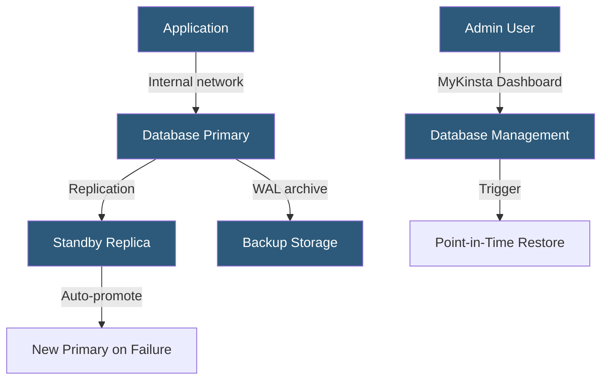

**Category:** Specialized Hosting Services
**Difficulty:** Intermediate
**Reading time:** 6 min read

---

Kinsta Database Hosting provides managed MySQL, PostgreSQL, and Redis database instances on Google Cloud Platform, offering automatic backups, connection pooling, high-availability configurations, and the MyKinsta dashboard for database management — extending Kinsta's managed hosting philosophy to standalone databases.

- **Managed Database** — A database instance where the provider handles OS patching, backups, and failover
- **Connection Pooling** — Reusing database connections to reduce the overhead of establishing new connections per query
- **High Availability (HA)** — A configuration with a primary and standby replica that auto-promotes on failure
- **Point-in-Time Recovery** — Restoring a database to any specific second within the backup retention window
- **Database Addon** — Kinsta's term for attaching a standalone database to an application or WordPress site
- **Internal Networking** — Connecting databases and applications within the same Google Cloud region without public internet exposure
- **Database Metrics** — CPU, memory, and query performance charts in the MyKinsta dashboard

Kinsta Database Hosting provisions database instances on Google Cloud's infrastructure in the same regional data centers as Kinsta's application hosting. Databases and applications communicating within the same region use Kinsta's internal network, avoiding public internet latency and egress charges.

MySQL and PostgreSQL instances are configured with automated daily backups and point-in-time recovery. PostgreSQL uses write-ahead log (WAL) archiving to GCS buckets, enabling recovery to any moment within the retention window. MySQL uses binary log-based incremental backup.

High-availability configurations deploy a primary database with a synchronous standby replica. If the primary fails, Kinsta's control plane detects the failure and promotes the standby within seconds, updating connection strings automatically. Applications using Kinsta's internal database hostname receive reconnection after the brief promotion window.

Connection pooling via PgBouncer (PostgreSQL) or ProxySQL (MySQL) reduces database connection overhead for applications with many concurrent processes. This is especially important for PHP-FPM pools where each worker process may hold a database connection.

The MyKinsta dashboard provides query performance metrics, connection count monitoring, and one-click backup restores. External access uses SSL-enforced connections with IP allowlisting to restrict which addresses can connect from outside Kinsta's network.

- Storing non-WordPress application data alongside Kinsta-hosted applications
- Providing managed Redis caching for session storage or queue backends
- Separating database concerns from application containers for independent scaling
- High-availability database requirements with automatic failover
- Teams preferring unified management of compute and database in one dashboard

| Advantage | Disadvantage |
|-----------|--------------|
| Google Cloud infrastructure with low internal latency | More expensive than self-managed cloud databases |
| High-availability with automatic failover | Fewer configuration options than direct cloud provider databases |
| Unified MyKinsta dashboard for all resources | Newer product with smaller community documentation |
| Point-in-time recovery for precise restores | Regional availability dependent on Kinsta's GCP footprint |

- [Kinsta WordPress Hosting](kinsta-wordpress-hosting.md)
- [Kinsta Static Site Hosting](kinsta-static-site-hosting.md)
- [Cloudways Managed Cloud Hosting](cloudways-managed-cloud-hosting.md)

---
*Part of the [Specialized Hosting Services](index.md) category · [Back to Master Index](../../index.md)*
