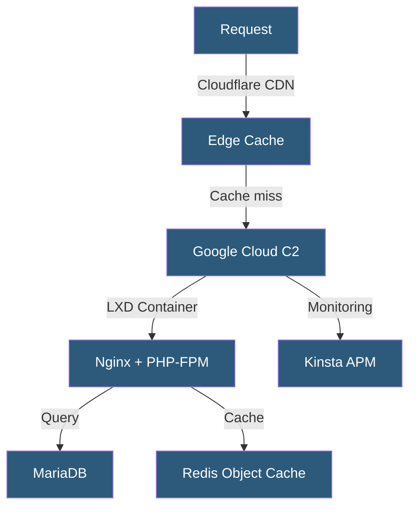

**Category:** Specialized Hosting Services
**Difficulty:** Intermediate
**Reading time:** 6 min read

---

Kinsta is a premium managed WordPress hosting platform built exclusively on Google Cloud Platform's C2 compute-optimized machines, offering isolated containerized environments, a proprietary CDN, built-in APM, and a developer-friendly MyKinsta dashboard with SSH, WP-CLI, and staging access.

- **Google Cloud C2** — Compute-optimized virtual machines providing high single-core performance for PHP workloads
- **LXD Containers** — Linux container technology isolating each site in its own software stack
- **MyKinsta Dashboard** — Kinsta's custom hosting management interface replacing traditional cPanel
- **Kinsta APM** — Built-in Application Performance Monitoring tool for diagnosing slow PHP transactions
- **Edge Caching** — Full-page HTML caching served from Kinsta's CDN edge nodes globally
- **Kinsta CDN** — A Cloudflare-powered CDN for static assets and optionally full-page caching
- **DevKinsta** — Kinsta's free local development application analogous to Local by WP Engine

Kinsta provisions each WordPress site inside an isolated LXD container running on Google Cloud's C2 machine type. Container isolation means one site's resource consumption does not affect neighboring sites — a critical difference from traditional shared hosting. PHP-FPM and Nginx are pre-configured for WordPress, and each container includes its own PHP version choosable per site.

The platform uses Nginx's FastCGI cache by default for full-page caching. Kinsta's edge caching feature pushes this a step further by caching full HTML at the CDN level — when enabled, even uncached pages served from origin reach visitors in milliseconds from nearby CDN nodes. Cache purging is automatic on WordPress publish events.

Redis object cache is available on all plans, storing expensive WordPress database queries in memory. This significantly reduces database load for sites with complex queries, WooCommerce catalogs, or heavy plugin stacks.

Kinsta's APM tool instruments PHP code at the function level, tracking which transactions (page loads, AJAX calls, REST API requests) consume the most time and breaking down execution into database queries, external HTTP calls, and PHP processing. This visibility enables pinpointing slow plugins or inefficient queries without needing a separate New Relic subscription.

Deployments use a git-based or SSH/SFTP workflow, and the MyKinsta dashboard provides environment-level controls for staging push/pull, database access, and log streaming.

- High-traffic WordPress and WooCommerce sites requiring reliable performance
- Developers needing SSH, WP-CLI, and modern PHP version flexibility
- Sites experiencing performance degradation from noisy neighbors on shared hosting
- Teams needing built-in APM for diagnosing WordPress performance issues
- Agencies managing multiple client sites from a single dashboard

| Advantage | Disadvantage |
|-----------|--------------|
| Google Cloud C2 delivers consistent PHP performance | Among the most expensive managed WordPress options |
| Container isolation prevents noisy-neighbor problems | WordPress-only platform |
| Built-in APM reduces need for third-party monitoring | No cPanel — requires learning MyKinsta |
| Edge caching minimizes origin load for global audiences | Entry plan limits on PHP workers and CDN bandwidth |

- [Kinsta APM Application Performance](kinsta-apm-application-performance.md)
- [Kinsta CDN and Edge Caching](kinsta-cdn-and-edge-caching.md)
- [WP Engine Managed WordPress](wp-engine-managed-wordpress.md)

---
*Part of the [Specialized Hosting Services](index.md) category · [Back to Master Index](../../index.md)*
