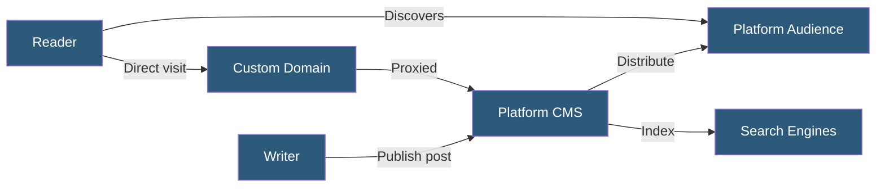

**Category:** Specialized Hosting Services
**Difficulty:** Beginner
**Reading time:** 5 min read

---

Medium-style publication hosting refers to platforms emulating Medium's hosted writing model — clean reading experiences, built-in audience distribution, and minimal configuration — including alternatives like Substack, Beehiiv, and Hashnode that provide different ownership and monetization models.

- **Publication** — A branded content channel hosted on the platform with a custom domain
- **Distribution Network** — The platform's built-in audience for recommending content to non-subscribers
- **Custom Domain** — Using an owned domain instead of the platform's default subdomain
- **Paywall** — Access restriction for premium content behind a paid subscription
- **Import** — Migrating existing content from other platforms via RSS or article URL
- **Publication Homepage** — A platform-hosted index page listing all posts for the publication
- **SEO Ownership** — Whether search engine traffic to custom domain content accrues to the publisher or the platform

Medium-style platforms operate as fully managed hosted publishing environments. Writers create accounts, compose articles in the platform's editor, and publish to a URL on the platform's domain (or a custom domain via DNS configuration). The platform handles hosting, CDN delivery, mobile optimization, and email delivery without any technical configuration by the author.

Medium itself uses a partner program and recommends content within its internal distribution network — stories with high engagement receive algorithmic amplification to non-subscriber readers. The platform's built-in audience is a core value proposition for new writers, trading control for distribution.

Alternative platforms diverge significantly on ownership: Substack gives writers direct subscriber relationships and email lists that can be exported, Beehiiv provides analytics and growth tools, and Hashnode targets the developer community with GitHub integration and custom domain SEO that accrues fully to the author.

The fundamental trade-off across all platforms is platform risk vs. ease of use. Content hosted on a platform is subject to the platform's monetization changes, content policies, and algorithm decisions. Platforms that support custom domains and content export (like Ghost, Substack, and Beehiiv) reduce lock-in risk compared to Medium, where content discoverability is tied to the Medium domain and algorithm.

- First-time writers wanting zero-configuration publishing with built-in audience
- Newsletter writers choosing Substack or Beehiiv for subscriber-owned distribution
- Developer bloggers using Hashnode for community discovery
- Journalists testing audience demand before building an independent platform
- Cross-posting strategy with canonical URLs from a primary owned domain

| Advantage | Disadvantage |
|-----------|--------------|
| Zero technical setup — write and publish immediately | Platform algorithm controls content discovery |
| Built-in audience discovery not available on self-hosted | SEO authority builds on the platform's domain (unless custom) |
| Mobile-optimized reading experience without CSS work | Monetization terms can change unilaterally |
| Email subscriber management included | Content export completeness varies by platform |

- [Ghost Pro Managed Hosting](ghost-pro-managed-hosting.md)
- [Ghost Newsletter Platform](ghost-newsletter-platform.md)
- [Webflow Hosting Platform](webflow-hosting-platform.md)

---
*Part of the [Specialized Hosting Services](index.md) category · [Back to Master Index](../../index.md)*
