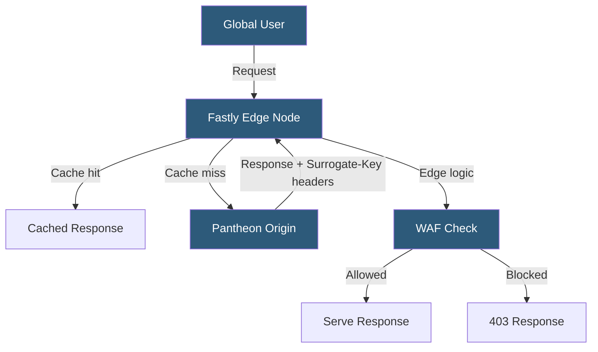

**Category:** Specialized Hosting Services
**Difficulty:** Advanced
**Reading time:** 7 min read

---

Pantheon's Advanced Global CDN (AGCDN) is a Fastly-powered edge layer offering custom CDN configuration capabilities including edge redirects, IP blocking, WAF rules, and geo-routing directly from the Pantheon platform, without requiring direct Fastly account management.

- **Edge Routing** — Directing traffic at CDN edge nodes based on URL patterns, headers, or geography
- **Edge Redirects** — HTTP 301/302 redirects executed at the CDN layer before requests reach origin
- **Image Optimization** — On-the-fly resizing and format conversion (WebP) at the edge
- **WAF (Web Application Firewall)** — Rule-based request filtering to block malicious traffic
- **IP Allowlist/Blocklist** — Restricting or permitting access based on client IP ranges
- **Geo-routing** — Serving different content or restricting access based on visitor country
- **Surrogate Keys** — Cache tags enabling surgical cache purging of specific content groups

Pantheon's standard Global CDN uses Fastly with default configurations managed by the platform. AGCDN extends this with customer-configurable VCL (Varnish Configuration Language) rules deployed at Fastly edge nodes through a Pantheon-managed interface, removing the need for direct Fastly account access.

Edge redirects intercept requests at CDN nodes and return redirect responses without consuming origin compute resources, dramatically reducing latency for high-volume redirect scenarios common after site migrations. Redirect rules are defined in a YAML-based configuration file in the site repository or via the dashboard.

Surrogate key-based cache invalidation allows content management systems to tag cached responses with semantic identifiers — such as a post ID or taxonomy term. When that content changes, a single purge call invalidates every cached URL associated with the tag, enabling precise cache clearing without full cache busts.

The integrated WAF applies OWASP and custom ruleset filtering at the Fastly layer, blocking SQL injection, XSS, and bot traffic before it reaches PHP processes. This reduces origin load and eliminates a class of application-layer attacks. IP blocking rules are expressed as CIDR ranges and can be managed without code deploys.

Geo-blocking and geo-routing support compliance requirements — EU data residency, GDPR-based access restrictions, or serving region-specific content variants from a single domain.

- Enterprise sites with thousands of legacy redirect rules
- GDPR compliance requiring EU visitor data handling
- High-traffic sites requiring WAF protection without separate security appliances
- Multi-language sites with country-based content routing
- Surgical cache invalidation for high-update-frequency CMS content

| Advantage | Disadvantage |
|-----------|--------------|
| Edge logic without direct Fastly account management | Requires AGCDN add-on at additional cost |
| Sub-millisecond redirect resolution at edge | VCL customization requires Pantheon support engagement |
| Surrogate key purging reduces unnecessary cache misses | Configuration complexity versus standard CDN |
| Integrated WAF reduces origin attack surface | Not suitable for sites needing multi-CDN strategies |

- [Pantheon WordPress/Drupal Hosting](pantheon-wordpress-drupal-hosting.md)
- [Pantheon WebOps Workflow](pantheon-webops-workflow.md)
- [Kinsta CDN and Edge Caching](kinsta-cdn-and-edge-caching.md)

---
*Part of the [Specialized Hosting Services](index.md) category · [Back to Master Index](../../index.md)*
