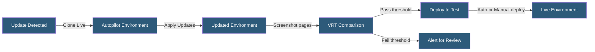

**Category:** Specialized Hosting Services
**Difficulty:** Intermediate
**Reading time:** 6 min read

---

Pantheon Autopilot is an automated CMS maintenance service that detects available updates for WordPress or Drupal core, themes, and plugins, applies them in a test environment, runs visual regression tests, and deploys only when tests pass — reducing manual maintenance burden for site portfolios.

- **Visual Regression Testing (VRT)** — Screenshot-based comparison detecting layout or content changes after updates
- **Update Detection** — Automated scanning for available CMS core, plugin, and theme updates
- **Autopilot Environment** — A dedicated Multidev environment where update testing occurs
- **Acceptance Threshold** — A configurable visual difference percentage below which tests auto-pass
- **Notification** — Email or Slack alerts when updates succeed, fail, or require manual review
- **Scheduled Runs** — Daily, weekly, or monthly update cadence configuration
- **Manual Override** — Dashboard controls to approve or skip specific detected updates

Autopilot operates on a scheduled cadence configured per site. When triggered, it creates or refreshes an isolated Multidev environment by cloning the Live database and applying the current codebase. It then applies all detected updates — WordPress core, plugins, themes, or Drupal modules — in this environment.

After applying updates, Autopilot crawls a configurable list of pages and captures full-page screenshots. These screenshots are compared pixel-by-pixel against baseline captures taken before the update. The difference percentage is calculated per page. If all pages fall below the acceptance threshold, the update is considered safe.

Sites configured for fully automated updates then proceed to deploy through Test to Live automatically. Sites requiring manual approval present results in the Autopilot dashboard, where administrators can review VRT diffs, approve, or reject updates.

Autopilot handles the complexity of update ordering — applying core updates before plugin updates when dependencies require it — and can exclude specific plugins or modules from automated updates. This is essential for plugins known to require manual testing.

The service reduces the most time-consuming aspect of WordPress maintenance: evaluating whether a plugin update is safe to deploy. For agencies managing dozens or hundreds of sites, Autopilot converts hours of manual testing into minutes of dashboard review.

- Agencies maintaining 50+ client WordPress sites
- Enterprise sites requiring documented update compliance
- Sites needing security patch deployment within defined SLAs
- Reducing time-to-deploy for non-breaking core updates
- Visual QA baseline maintenance after design changes

| Advantage | Disadvantage |
|-----------|--------------|
| Eliminates manual update-test-deploy cycle | VRT may miss functional regressions without visual changes |
| Visual regression catches layout-breaking updates | Requires curating the page list for VRT coverage |
| Configurable acceptance threshold per site | Only available on Elite and above Pantheon plans |
| Audit trail of all updates applied and tested | False positives require manual review time |

- [Pantheon WebOps Workflow](pantheon-webops-workflow.md)
- [WP Engine Smart Plugin Manager](wp-engine-smart-plugin-manager.md)
- [Kinsta WordPress Hosting](kinsta-wordpress-hosting.md)

---
*Part of the [Specialized Hosting Services](index.md) category · [Back to Master Index](../../index.md)*
