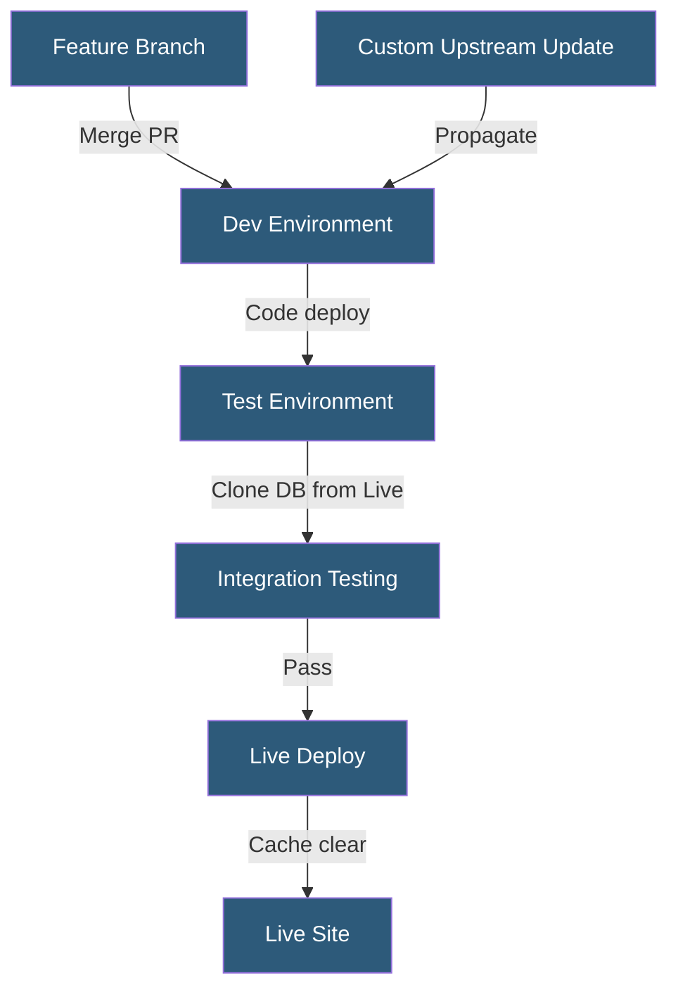

**Category:** Specialized Hosting Services
**Difficulty:** Intermediate
**Reading time:** 6 min read

---

Pantheon's WebOps workflow is a structured development methodology combining git version control, environment promotion pipelines, and automated testing to manage the full lifecycle of web content management systems from code commit to live deployment.

- **Environment Promotion** — Moving code from Dev to Test to Live through explicit deploy actions
- **Upstream** — A shared git repository that delivers core CMS updates to all sites forking from it
- **Custom Upstream** — An agency- or organization-managed upstream that distributes shared themes and plugins
- **Quicksilver** — Pantheon's platform hook system for running scripts at key workflow events
- **Deployment Artifact** — The compiled code state deployed to an environment at a specific commit
- **Database Clone** — Copying the MySQL database from one environment to another for realistic testing
- **Pantheon Dashboard** — The web UI for managing environments, deployments, and site settings

Pantheon's workflow enforces a one-way code flow: code moves forward from Dev to Test to Live, while database and file content moves backward for synchronization. This prevents the common pattern of making production database edits that become out of sync with lower environments.

Custom Upstreams are git repositories configured as the parent for a set of sites. When the upstream receives a commit — a WordPress core update, a shared plugin, or a framework change — Pantheon detects the upstream has diverged and surfaces the update as an available apply action for each child site. Agencies use this to push approved plugin bundles to all client sites simultaneously.

Quicksilver hooks execute PHP or Bash scripts at defined pipeline events: `deploy`, `sync_code`, `clone_database`, `clear_cache`, and others. These hooks integrate with Slack, PagerDuty, New Relic deployments, or custom post-deploy scripts. Hooks are defined in a `pantheon.yml` file at the repository root.

The Terminus CLI automates the entire workflow programmatically — creating environments, deploying code, cloning databases, and running drush/wp-cli commands — enabling CI/CD pipelines to orchestrate Pantheon operations from external build systems like CircleCI or GitHub Actions.

- Enforcing code review before production deployment
- Propagating CMS updates across a portfolio of 100+ sites
- Running database migrations in isolated Test before applying to Live
- Post-deploy Slack notifications via Quicksilver
- CI/CD integration with external testing tools

| Advantage | Disadvantage |
|-----------|--------------|
| Enforced workflow prevents ad-hoc production edits | Strict pipeline can feel rigid for small teams |
| Custom Upstreams enable centralized update management | Upstream conflicts require git expertise to resolve |
| Quicksilver hooks enable rich deploy automation | Hooks limited to PHP and Bash |
| Terminus enables full CI/CD automation | Learning curve for developers new to the Pantheon model |

- [Pantheon WordPress/Drupal Hosting](pantheon-wordpress-drupal-hosting.md)
- [Pantheon Autopilot](pantheon-autopilot.md)
- [WP Engine Smart Plugin Manager](wp-engine-smart-plugin-manager.md)

---
*Part of the [Specialized Hosting Services](index.md) category · [Back to Master Index](../../index.md)*
