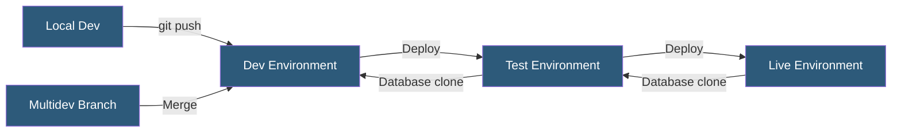

**Category:** Specialized Hosting Services
**Difficulty:** Intermediate
**Reading time:** 6 min read

---

Pantheon is a WebOps platform purpose-built for WordPress and Drupal hosting, providing containerized environments with a structured Dev/Test/Live workflow. It focuses on developer velocity, automated updates, and scalable performance for agencies and enterprise teams managing multiple CMS sites.

- **WebOps** — The practice of combining web development and operations with automated workflows
- **Multidev** — Pantheon's feature for creating disposable git-branch-based environments for feature development
- **SFTP/Git Mode** — A per-environment toggle switching between file-based editing and git-based deployment
- **Terminus** — Pantheon's command-line tool for managing sites, environments, and workflows programmatically
- **Object Cache (Redis)** — An in-memory cache layer available on performance and above plans
- **Solr Search** — Apache Solr indexing service integrated for advanced search capabilities
- **Autopilot** — Pantheon's automated visual regression testing and CMS update service

Pantheon runs each site environment in isolated Linux containers with PHP-FPM, Nginx, and MariaDB. The platform uses a git-based deployment model where code changes flow from Dev to Test to Live via the Pantheon dashboard or Terminus CLI. Database and file content travels upstream (Live to Test to Dev) via clone operations, ensuring developers work with realistic data.

Each environment is a complete independent stack, allowing parallel QA, staging, and production workloads without shared resource contention. Multidev environments extend this model by creating full stack copies for every git branch, enabling teams to build and test features in isolation before merging.

Pantheon's Global CDN uses Fastly under the hood, caching full pages at edge nodes worldwide. Cache clearing is automatic on content publish events via WordPress or Drupal hooks. The New Relic integration provides APM visibility, while the Solr and Redis add-ons enable enterprise search and session caching.

Autopilot takes scheduled snapshots of page screenshots, applies CMS and plugin updates, runs visual regression tests comparing before/after screenshots, and deploys only when tests pass — reducing maintenance overhead for agencies managing large site portfolios.

- Agency management of dozens of client WordPress/Drupal sites
- Enterprise CMS sites requiring structured promotion workflows
- Headless WordPress deployments with decoupled frontends
- Sites with strict uptime requirements needing zero-downtime deploys
- Teams requiring feature branch environments per developer

| Advantage | Disadvantage |
|-----------|--------------|
| Purpose-built workflow for CMS hosting | Only supports WordPress and Drupal |
| Multidev eliminates environment sharing conflicts | Higher cost than generic managed hosting |
| Global CDN with automatic cache purging | Limited server-side customization vs VPS |
| Autopilot reduces update maintenance burden | Storage limits per plan tier |

- [Pantheon WebOps Workflow](pantheon-webops-workflow.md)
- [Pantheon Advanced Global CDN](pantheon-advanced-global-cdn.md)
- [WP Engine Managed WordPress](wp-engine-managed-wordpress.md)

---
*Part of the [Specialized Hosting Services](index.md) category · [Back to Master Index](../../index.md)*
