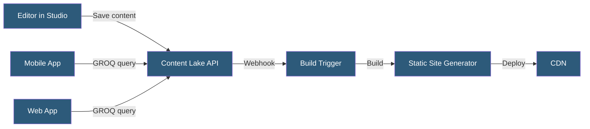

**Category:** Specialized Hosting Services
**Difficulty:** Intermediate
**Reading time:** 6 min read

---

Sanity.io is a headless CMS with a fully managed API-first content platform, configurable Studio editing interface, real-time content collaboration, and GROQ query language for flexible content retrieval across web, mobile, and any channel consuming the Content Lake API.

- **Content Lake** — Sanity's hosted content repository storing all structured content as documents
- **GROQ** — Graph-Relational Object Queries, Sanity's native query language for precise content fetching
- **Sanity Studio** — An open-source React-based CMS editing interface customized in JavaScript
- **Schema** — JavaScript code defining content types, field validations, and document structures
- **CDN API** — Sanity's globally distributed read API for fast content delivery
- **Webhooks** — Event notifications sent when content is created, updated, or deleted
- **Portable Text** — Sanity's rich text format encoded as JSON for rendering in any technology

Sanity separates the CMS into two independently managed components: the Content Lake (managed cloud API) and Sanity Studio (self-hosted editing interface). Content Lake stores all content documents in Sanity's infrastructure, accessible via authenticated API calls globally.

Sanity Studio is a React application defined by a JavaScript schema file that specifies content types — their fields, validation rules, and input components. The schema is code, allowing version control, custom validation logic, and conditional fields expressed in JavaScript. Studio can be self-hosted alongside an application or hosted on Sanity's managed `sanity.studio` infrastructure.

GROQ queries allow fetching precisely structured content with joins, filtering, and projections. A query like `*[_type == "post" && published == true]{title, slug, body[0..2]}` retrieves all published posts with only three fields, avoiding over-fetching. GROQ supports references (joins to other documents), array filtering, ordering, and pagination.

Real-time content updates use Sanity's listener API — a streaming connection notifying subscribed clients when documents change. This enables live preview in the editing interface and real-time content updates in production applications without polling.

Webhooks integrate Sanity with deployment pipelines: a content publish event triggers a Netlify or Vercel rebuild, an inventory update triggers a warehouse sync, or a new entry triggers an email notification.

- Omnichannel content delivery from one CMS to web, mobile, and smart TV
- Marketing sites with complex custom content types requiring code-defined schemas
- Applications requiring real-time content updates without polling
- Teams wanting CMS logic in version-controlled JavaScript
- Structured content powering AI retrieval-augmented generation pipelines

| Advantage | Disadvantage |
|-----------|--------------|
| Schema-as-code enables version control and CI/CD for CMS structure | Steeper learning curve than GUI-configured CMSes |
| GROQ prevents over-fetching complex content relationships | GROQ is proprietary — not transferable to other CMSes |
| Real-time collaborative editing built-in | Content Lake costs scale with API requests and storage |
| Portable Text format works across any rendering technology | Self-hosting Studio requires separate deployment |

- [Gatsby Cloud (now Netlify)](gatsby-cloud-now-netlify.md)
- [Contentful Headless CMS](contentful-headless-cms.md)
- [Directus Data Platform](directus-data-platform.md)

---
*Part of the [Specialized Hosting Services](index.md) category · [Back to Master Index](../../index.md)*
