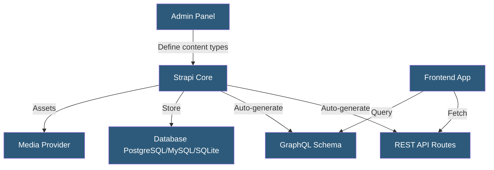

**Category:** Specialized Hosting Services
**Difficulty:** Intermediate
**Reading time:** 6 min read

---

Strapi is an open-source headless CMS framework that developers self-host or deploy to Strapi Cloud, offering a customizable REST and GraphQL API auto-generated from content types defined in the admin panel or code, with full control over the database, authentication, and business logic.

- **Content Type** — A structured schema defining the shape of content with field types and relations
- **Single Type** — A content type that has only one entry (e.g., homepage settings, global navigation)
- **Collection Type** — A content type with multiple entries (e.g., articles, products)
- **Plugin** — A Strapi extension adding functionality (e-commerce, internationalization, custom fields)
- **Strapi Cloud** — Strapi's managed hosting platform for deploying self-managed Strapi instances
- **Policies** — Middleware-style functions controlling access to API routes
- **Media Library** — Built-in file management with support for external providers (Cloudinary, AWS S3)

Strapi generates a fully functional REST API and optional GraphQL API from content type definitions. Developers define content types via the admin panel GUI or as JavaScript files in the codebase. Each content type automatically receives CRUD endpoints under `/api/{collection-name}`.

The content type system supports single types (singleton content), collection types (lists of items), and components (reusable field groups). Relations between types — one-to-one, one-to-many, many-to-many — are defined in the type builder and reflected in the generated API as populated relations.

Role-Based Access Control (RBAC) restricts API endpoints by role. The public role can access specific GET endpoints without authentication, while write operations require a JWT token from the Users & Permissions plugin or a custom auth provider. Strapi supports API tokens for server-to-server access and user-specific JWT for frontend authentication.

Customization is Strapi's core differentiator from SaaS CMSes: lifecycle hooks execute custom code before or after database operations (beforeCreate, afterUpdate), custom routes add business logic beyond CRUD, and plugins extend the admin panel and API. The media library integrates with Cloudinary or S3 to store assets externally rather than on the local filesystem.

Self-hosting Strapi on a VPS, container platform, or Strapi Cloud gives full control over the database, environment variables, and deployment pipeline.

- Teams wanting full-stack control over their headless CMS without SaaS lock-in
- Applications requiring custom business logic in the CMS API layer
- Multi-tenant applications building tenant-specific content APIs
- Mobile app backends needing both CMS and authentication in one platform
- Projects with compliance requirements preventing use of third-party hosted CMSes

| Advantage | Disadvantage |
|-----------|--------------|
| Open-source with full code access and customization | Self-hosted infrastructure management burden |
| Auto-generated REST and GraphQL APIs from content types | Migration complexity when upgrading major versions |
| Rich plugin ecosystem for extending functionality | Admin panel scales poorly for non-technical content editors |
| No per-API-call costs — flat hosting cost | Less enterprise support than commercial headless CMSes |

- [Contentful Headless CMS](contentful-headless-cms.md)
- [Directus Data Platform](directus-data-platform.md)
- [Sanity.io Headless CMS Hosting](sanity-io-headless-cms-hosting.md)

---
*Part of the [Specialized Hosting Services](index.md) category · [Back to Master Index](../../index.md)*
