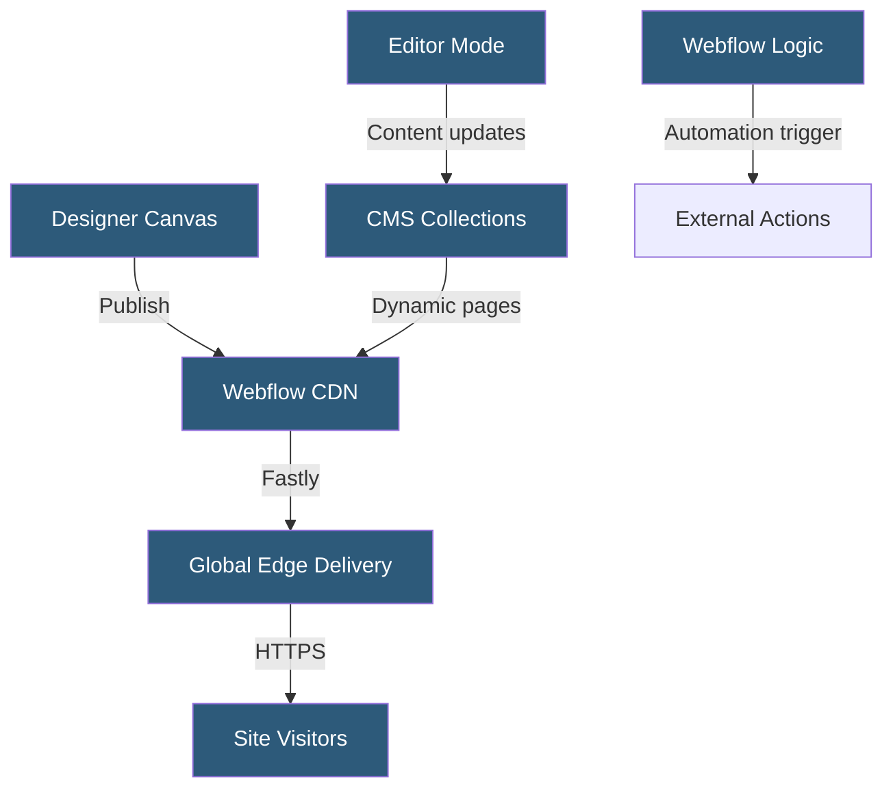

**Category:** Specialized Hosting Services
**Difficulty:** Intermediate
**Reading time:** 6 min read

---

Webflow is a visual web development platform combining a no-code design tool, a headless CMS, and managed hosting infrastructure, allowing designers and developers to build production websites without writing HTML/CSS by hand while still producing semantically correct, exportable code.

- **Designer** — Webflow's visual canvas for building layouts using CSS properties without writing code
- **CMS** — Webflow's built-in headless content management for dynamic collection pages
- **Collection** — A structured content type with defined fields used to generate dynamic pages
- **Hosting** — Webflow's managed CDN delivery via Fastly for published sites
- **Interactions** — A timeline-based animation and scroll-trigger system without custom JavaScript
- **Editor Mode** — A simplified interface for non-technical editors to update CMS content live
- **Webflow Logic** — A built-in workflow automation system for triggered actions on form submissions

Webflow's Designer operates on a box model matching CSS's flexbox and grid layout systems. Every visual change in the designer generates corresponding CSS rules, ensuring that exported code matches the visual representation. Responsive breakpoints are defined visually — designers adjust layouts for each screen size using the same visual tools.

The Webflow CMS stores structured content in Collections. Each Collection has defined fields (text, rich text, images, references, numbers, etc.) and generates two types of pages: a list template and a detail template per collection item. Dynamic binding connects CMS field values to visual elements — a blog post's title field binds to an `h1` element, the body field binds to a rich text component.

Published sites are hosted on Webflow's Fastly-powered CDN with automatic HTTPS via Let's Encrypt. Pages are pre-rendered server-side and cached at edge nodes. CMS content changes in Editor Mode publish instantly without a build step.

Webflow Logic automates backend operations without custom server code: when a form is submitted, Logic can send an email, create a CMS item, call a webhook, or trigger a Zapier workflow. This reduces the need for external automation tools for common site interactions.

Code export allows downloading the generated HTML, CSS, and JavaScript for self-hosting, though exported sites lose Webflow CMS functionality.

- Marketing sites requiring custom design without developer dependency
- Agencies building client websites with editor handoff via Editor Mode
- Portfolio sites with case study collections in the CMS
- SaaS marketing pages with blog sections managed by content teams
- Sites combining visual design with no-code automation via Webflow Logic

| Advantage | Disadvantage |
|-----------|--------------|
| Design and hosting in one tool without handoff | Significant learning curve for complex layouts |
| Editor Mode enables non-technical content updates | Webflow hosting is expensive compared to generic static hosting |
| Fastly CDN with automatic HTTPS and global delivery | CMS API limits on lower plans |
| Code export provides escape hatch | Exported code loses dynamic CMS functionality |

- [Ghost Pro Managed Hosting](ghost-pro-managed-hosting.md)
- [Kinsta Static Site Hosting](kinsta-static-site-hosting.md)
- [Contentful Headless CMS](contentful-headless-cms.md)

---
*Part of the [Specialized Hosting Services](index.md) category · [Back to Master Index](../../index.md)*
