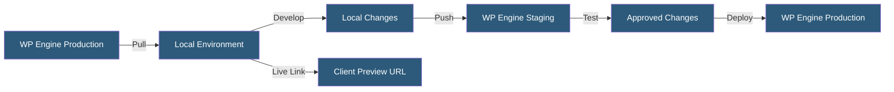

**Category:** Specialized Hosting Services
**Difficulty:** Beginner
**Reading time:** 5 min read

---

Local by Flywheel (now branded Local) is a free desktop application for macOS, Windows, and Linux that creates self-contained WordPress development environments, integrating with WP Engine for push/pull site workflows between local and hosted environments.

- **Local Site** — A fully containerized WordPress installation running on the developer's machine
- **Router Mode** — A setting controlling whether Local uses a shared or per-site network stack
- **Blueprint** — A saved site configuration (PHP version, web server, database) for rapid environment replication
- **Live Link** — A tunneled public URL exposing a local site for client preview or remote testing
- **Pull** — Downloading a WP Engine hosted site (files + database) to a local environment
- **Push** — Uploading a local site's database or files to a WP Engine staging or production environment
- **Addon** — Third-party Local extensions for tools like MailHog email testing or Instant Reload

Local runs Docker containers under the hood to create isolated WordPress environments on the developer's workstation. Each site gets its own PHP version, web server (Nginx or Apache), and MySQL/MariaDB database, configurable per site. The application manages DNS routing so sites are accessible at `.local` domains without manually editing `/etc/hosts`.

Connecting Local to WP Engine requires logging in with WP Engine credentials inside the application. Once connected, a list of WP Engine sites appears, and developers can pull the database and wp-content folder from any WP Engine environment. The pull operation overwrites the local database and syncs file changes, giving developers an exact replica of production for testing.

Pushing sends the local database or file changes back to a WP Engine staging environment. Push operations support selective sync — database only, files only, or both — preventing accidental data overwrites.

Live Link creates a tunneled public URL (via ngrok technology) exposing the local site over HTTPS without opening firewall ports. This is widely used for demonstrating in-progress work to clients or debugging webhooks from external services that require a reachable URL.

Blueprints save a site's configuration as a reusable template, allowing teams to standardize development environments across members and eliminate "works on my machine" configuration drift.

- Developing and testing WordPress themes and plugins locally
- Pulling client sites from WP Engine for offline debugging
- Sharing in-progress work via Live Link without deployment
- Standardizing team environments through Blueprints
- Rapid onboarding of new developers with one-click environment setup

| Advantage | Disadvantage |
|-----------|--------------|
| Free application with no seat limits | Deep integration primarily with WP Engine |
| Exact PHP/DB version matching to production | Docker dependency can cause issues on some Windows setups |
| Live Link enables instant client demos | Live Link tunnels have bandwidth and time limits |
| Blueprints enforce environment consistency | Not suitable for non-WordPress projects |

- [WP Engine Managed WordPress](wp-engine-managed-wordpress.md)
- [WP Engine Smart Plugin Manager](wp-engine-smart-plugin-manager.md)
- [Kinsta WordPress Hosting](kinsta-wordpress-hosting.md)

---
*Part of the [Specialized Hosting Services](index.md) category · [Back to Master Index](../../index.md)*
