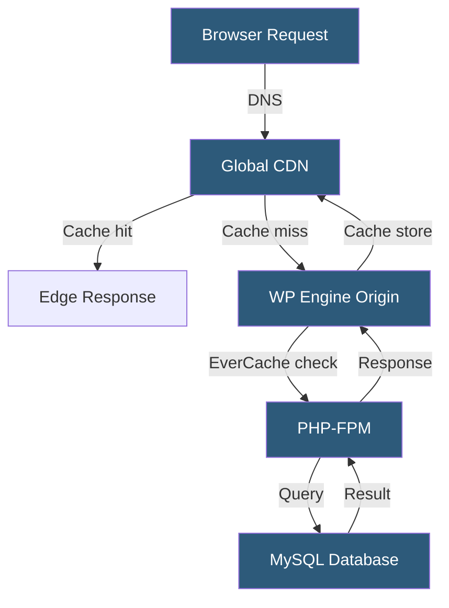

**Category:** Specialized Hosting Services
**Difficulty:** Intermediate
**Reading time:** 6 min read

---

WP Engine is a managed WordPress hosting platform offering performance-optimized infrastructure, automated backups, developer tools, and a curated plugin ecosystem. It targets businesses and agencies requiring reliable WordPress hosting with built-in security scanning, CDN integration, and staging environments.

- **EverCache** — WP Engine's proprietary page caching layer optimizing WordPress response times
- **Staging Environment** — A copy-of-production environment for development and testing, included on all plans
- **Smart Plugin Manager** — Automated plugin update testing and deployment service
- **Local by Flywheel** — A free desktop application for local WordPress development with WP Engine push/pull
- **Genesis Framework** — A premium WordPress framework owned by WP Engine via StudioPress acquisition
- **Global CDN** — Network of edge servers distributing static assets and cached pages globally
- **SSH Gateway** — WP Engine's tunneled SSH access providing WP-CLI and terminal access to sites

WP Engine provisions each site on high-performance cloud infrastructure (Google Cloud Platform for most plans) with PHP-FPM and Nginx configured specifically for WordPress. EverCache, WP Engine's caching system, intercepts requests before WordPress PHP execution and serves pre-generated full-page HTML. Cache is invalidated automatically when posts are published, themes are updated, or a manual purge is triggered.

Sites include a staging environment at `sitename.wpenginestagingco.com`, sharing no infrastructure with production. Pushing code or pulling databases between environments is available via the User Portal or the WP Engine API. The platform runs daily automated backups retained for 40 days on standard plans, with point-in-time restore available on higher tiers.

Security scanning runs continuously, monitoring for known malware signatures, suspicious file changes, and known WordPress vulnerability patterns. WP Engine blocks common attack vectors including XML-RPC abuse, login brute force, and directory traversal at the infrastructure level before PHP processes them.

The SSH Gateway allows WP-CLI execution — importing databases, managing users, regenerating thumbnails — without requiring traditional SSH server access. Developers connect via WP Engine's authentication proxy, which logs all commands for audit purposes.

- Business WordPress sites requiring managed security and backups
- Agency client sites needing staging with no extra configuration
- Sites relying on the Genesis Framework and StudioPress themes
- Teams using Local by Flywheel for development workflows
- WooCommerce stores needing proven WordPress-optimized performance

| Advantage | Disadvantage |
|-----------|--------------|
| EverCache is highly effective for WordPress performance | Prohibits certain plugins conflicting with the platform |
| Staging environment on all plans | More expensive than generic managed hosting |
| Smart Plugin Manager reduces maintenance overhead | Limited server-side customization options |
| Continuous malware scanning and removal | No cPanel — proprietary User Portal only |

- [WP Engine Smart Plugin Manager](wp-engine-smart-plugin-manager.md)
- [WP Engine Local Development](wp-engine-local-development.md)
- [Kinsta WordPress Hosting](kinsta-wordpress-hosting.md)

---
*Part of the [Specialized Hosting Services](index.md) category · [Back to Master Index](../../index.md)*
