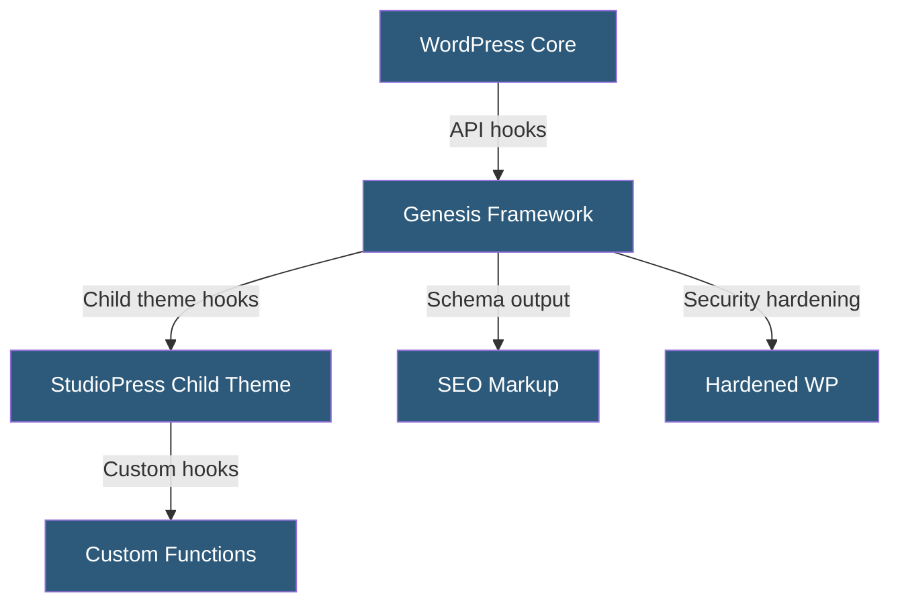

**Category:** Specialized Hosting Services
**Difficulty:** Beginner
**Reading time:** 5 min read

---

StudioPress is a premium WordPress theme company acquired by WP Engine that produces the Genesis Framework and a library of child themes, offering developers a structured, SEO-friendly, accessibility-ready foundation for building WordPress sites without starting from scratch.

- **Genesis Framework** — A parent theme providing core functionality, security hardening, and SEO structure
- **Child Theme** — A visual layer built on top of Genesis that inherits its functionality while adding custom design
- **Genesis Hooks** — PHP action and filter hooks for inserting content or modifying output without editing core files
- **Schema Markup** — Structured data embedded by Genesis for rich search result formatting
- **Widgetized Areas** — Configurable sidebar and content areas manageable without code
- **Theme Settings Page** — A Genesis-specific admin panel for layout, navigation, and SEO configuration
- **Pro Plus Membership** — WP Engine plan tier including access to all StudioPress themes

The Genesis Framework operates as a parent theme in WordPress's theme hierarchy. It handles the document structure, header/footer rendering, loop logic, pagination, SEO title tags, and security hardening. Child themes built on Genesis only define visual styles (CSS), layout modifications, and custom template overrides without touching the framework's core functionality.

This separation means that when Genesis receives updates — security patches, WordPress compatibility fixes, feature additions — child themes are not broken because they never directly modify framework files. Developers extend Genesis through its hook system: `genesis_before_header`, `genesis_after_entry`, and dozens of other action points allow inserting HTML, widgets, or custom PHP at specific document positions.

Schema.org structured data is automatically embedded by Genesis for articles, breadcrumbs, and author information, providing SEO benefits without manual markup. The framework includes a robust settings API that child themes inherit, giving site administrators control over layout (full-width, content-sidebar, sidebar-content, etc.) per post type.

WP Engine's Pro Plus plan includes unlimited access to all StudioPress child themes, making it cost-effective for agencies building multiple sites on the Genesis ecosystem.

- Building SEO-optimized WordPress sites on a proven foundation
- Agency development using a standardized parent theme for all clients
- Accessibility-compliant site development leveraging Genesis's heading and ARIA structure
- Custom plugin development using Genesis hooks for output injection
- Rapid prototyping with design-ready child themes

| Advantage | Disadvantage |
|-----------|--------------|
| Stable, frequently updated framework with long history | Less visually flashy than page-builder themes |
| Genesis hooks enable deep customization without core edits | Requires PHP knowledge for advanced customizations |
| Schema markup improves search appearance automatically | Not compatible with all WordPress page builders |
| Included with WP Engine Pro Plus plans | Genesis ecosystem smaller than Elementor/Divi ecosystems |

- [WP Engine Managed WordPress](wp-engine-managed-wordpress.md)
- [WP Engine Page Performance](wp-engine-page-performance.md)
- [Webflow Hosting Platform](webflow-hosting-platform.md)

---
*Part of the [Specialized Hosting Services](index.md) category · [Back to Master Index](../../index.md)*
