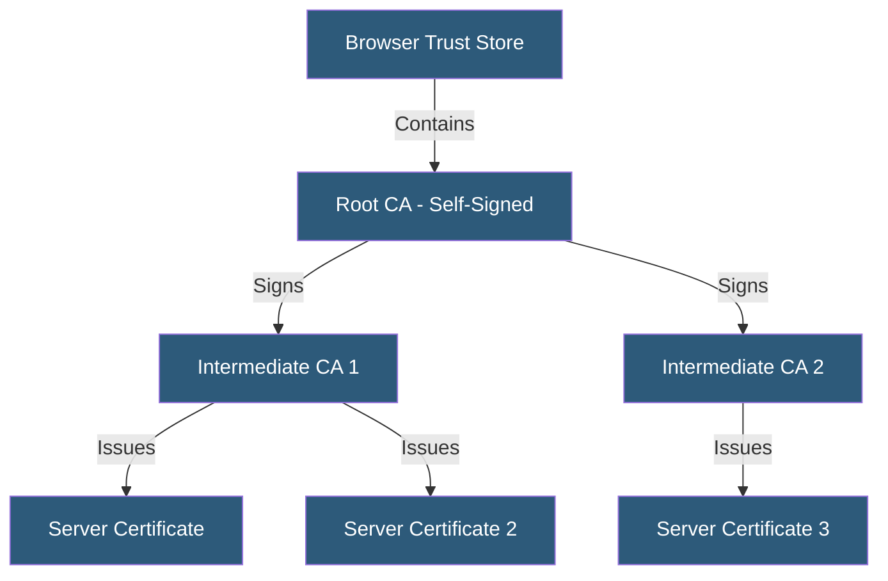

**Category:** SSL/TLS & Certificates
**Difficulty:** Intermediate
**Reading time:** 6 min read

---

The CA hierarchy is a trust infrastructure where root CAs in browser and OS trust stores delegate issuance authority to intermediate CAs, which issue end-entity certificates. This chain structure isolates high-value root keys from issuance operations while maintaining traceable trust.

- **Root CA** — A self-signed CA certificate embedded in browser/OS trust stores as a trust anchor
- **Intermediate CA** — A CA certificate signed by the root, used for actual certificate issuance
- **End-Entity Certificate** — A certificate issued to a server or client, not authorized to sign other certificates
- **Certificate Chain** — The ordered sequence from end-entity certificate through intermediates to the root
- **Trust Store** — OS or browser collection of trusted root CA certificates
- **Cross-Certification** — A root CA signing another CA's certificate to extend its trust
- **CA/Browser Forum** — Industry body setting baseline requirements for publicly trusted CAs

Root CA private keys are stored offline in hardware security modules (HSMs) within physically secured facilities. Because root keys sign intermediate CA certificates (an operation performed infrequently), they can remain offline, minimizing exposure. If a root CA key were compromised, every certificate it had issued would lose trust — a catastrophic outcome.

Intermediate CAs hold online keys used for daily certificate issuance. An intermediate CA's certificate is signed by the root, so browsers can build the chain: end-entity cert → intermediate cert → root cert (in trust store). The Basic Constraints extension marks root and intermediate certificates with `CA:TRUE`, and the Path Length Constraint limits how many additional intermediate hops are allowed below a given CA.

Servers must include the full certificate chain (end-entity + intermediates) in the TLS handshake. Browsers typically do not cache intermediate certificates — if a server omits them, some clients (especially curl and non-browser HTTP clients) cannot build the chain to the trusted root and will reject the connection.

Let's Encrypt uses intermediates signed by the ISRG Root X1 (RSA) and ISRG Root X2 (ECDSA), with cross-signed intermediates from IdenTrust's DST Root CA X3 maintaining compatibility with older Android devices that lack Let's Encrypt's root.

- Diagnosing "certificate not trusted" errors caused by missing intermediate certificates
- Building private PKI for enterprise internal services with custom root CAs
- Understanding why revoking one intermediate CA can cascade to all issued certificates
- Configuring HSM-backed intermediate CAs for enterprise issuance infrastructure
- Auditing CA hierarchy in CT logs for unauthorized intermediate CA creation

| Advantage | Disadvantage |
|-----------|--------------|
| Root key isolation prevents mass trust compromise | Chain building failure from missing intermediates causes client errors |
| Intermediate CAs can be revoked without revoking the root | Trust store changes (adding/removing roots) require OS/browser updates |
| Multiple intermediates enable operational separation of issuance | Cross-signed intermediates add chain validation complexity |
| Auditable trust chains via CT logs | Intermediate CA compromise requires emergency revocation and reissuance |

- [Certificate Chain of Trust](certificate-chain-of-trust.md)
- [Root and Intermediate Certificates](root-and-intermediate-certificates.md)
- [Certificate Revocation Lists (CRL)](certificate-revocation-lists-crl.md)

---
*Part of the [SSL/TLS & Certificates](index.md) category · [Back to Master Index](../../index.md)*
