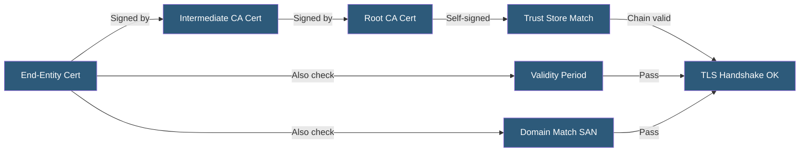

**Category:** SSL/TLS & Certificates
**Difficulty:** Intermediate
**Reading time:** 6 min read

---

The certificate chain of trust is the cryptographic verification path from a server's end-entity certificate through one or more intermediate certificates to a trusted root CA, ensuring each certificate in the chain is validly signed by the certificate above it.

- **Chain Verification** — The process of checking each certificate's signature against its issuer's public key
- **Issuer/Subject** — Certificate fields used to link chain elements; issuer of cert N matches subject of cert N+1
- **Authority Key Identifier (AKI)** — Extension identifying the signing CA's key for efficient chain building
- **Chain Building** — The algorithm for constructing the path from end-entity cert to trusted root
- **Path Length** — The number of intermediate CAs allowed between root and end-entity
- **Pinned Certificate** — A client hard-coding an expected certificate or key for a specific connection
- **Partial Chain** — A chain that does not reach a trusted root, causing a trust failure

When a TLS handshake begins, the server sends its certificate and the certificate chain (all intermediate CA certificates up to but not including the root). The client receives this chain and begins verification by checking the end-entity certificate's signature using the issuer's public key from the first intermediate CA certificate.

The client continues up the chain, checking each intermediate CA certificate's signature against the next certificate's public key. When the client reaches a certificate whose issuer is a root CA in its trust store, it verifies the root's self-signature and concludes chain validation.

Beyond signature verification, the client checks each certificate's validity period (not before/not after dates), whether the certificate has been revoked (via CRL or OCSP), whether its Basic Constraints allow CA operations at its position in the chain, and for the end-entity certificate, whether the server's hostname matches a Subject Alternative Name.

A common operational failure is servers that do not include intermediate certificates in the TLS handshake. Browsers cache intermediates and often succeed, but command-line tools (curl, openssl s_client) and non-browser clients that don't cache intermediates fail with "unable to verify the first certificate" or similar errors.

Chain building algorithms in TLS libraries (OpenSSL, NSS, Secure Transport) may find multiple valid paths when cross-certificates exist, selecting the path that leads to the most trusted root.

- Diagnosing "certificate not trusted" errors in non-browser TLS clients
- Validating complete certificate chains before deployment
- Understanding why browsers succeed while API clients fail
- Debugging Let's Encrypt cross-signed chain compatibility issues
- Auditing enterprise PKI deployments for complete chain configuration

| Advantage | Disadvantage |
|-----------|--------------|
| Cryptographic verification provides strong tamper detection | Missing intermediates cause client-specific failures |
| Standard X.509 chain structure supported universally | Long chains increase TLS handshake data size |
| Browser intermediate caching improves UX | Cached intermediates in browsers mask server configuration errors |
| Multiple valid paths via cross-certificates extend compatibility | Chain building complexity can produce different paths on different clients |

- [Certificate Authority (CA) Hierarchy](certificate-authority-ca-hierarchy.md)
- [Root and Intermediate Certificates](root-and-intermediate-certificates.md)
- [OCSP (Online Certificate Status Protocol)](ocsp-online-certificate-status-protocol.md)

---
*Part of the [SSL/TLS & Certificates](index.md) category · [Back to Master Index](../../index.md)*
