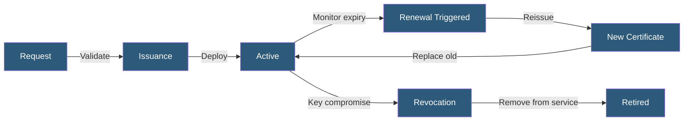

**Category:** SSL/TLS & Certificates
**Difficulty:** Intermediate
**Reading time:** 6 min read

---

Certificate lifecycle management (CLM) covers the complete operational process of issuing, deploying, monitoring, renewing, and revoking TLS certificates across an organization's infrastructure, with the goal of preventing service disruptions from certificate expiration and maintaining cryptographic hygiene.

- **Certificate Inventory** — A complete record of all certificates in use, their expiration dates, and deployment locations
- **Certificate Discovery** — Automated scanning to find certificates across network infrastructure
- **Renewal Window** — The period before expiration when renewal should be triggered (typically 30–60 days)
- **Certificate Aging** — The gradual reduction of maximum certificate validity (now 398 days for public certs)
- **Revocation** — Invalidating a certificate before expiration due to key compromise or decommissioning
- **CLM Platform** — Specialized software (Venafi, AppViewX, DigiCert CertCentral) managing certificate operations
- **Certificate Sprawl** — Uncontrolled proliferation of certificates issued without centralized tracking

Effective CLM begins with certificate discovery — automated scanning of internal networks, load balancers, CDN configurations, and application servers to build a comprehensive inventory. Tools like Qualys SSL Labs, Censys, or Nmap SSL scanning can identify certificates that were deployed outside the standard provisioning process.

The inventory tracks each certificate's subject, expiration date, deployment location, responsible team, and renewal method. Centralized CLM platforms (Venafi Trust Authority, DigiCert CertCentral, AppViewX CERT+) integrate with CAs, infrastructure APIs, and ITSM systems to automate the renewal and deployment pipeline.

Monitoring generates alerts at configurable thresholds before expiration — typically 60, 30, and 14 days. Some organizations use tiered escalation: team email at 60 days, management notification at 30 days, PagerDuty alert at 14 days. Certificate monitoring services (Uptime Robot, SSL Labs API, cert-manager alerting) provide external verification.

Maximum certificate validity has been steadily reduced by browser/CA policy: from multi-year certificates, to 2 years (2018), to 398 days (2020). Industry discussions are ongoing about further reductions to 90 days or even 45 days, mirroring Let's Encrypt's model and making automation a necessity rather than an option.

Rotation policies define when private keys must be regenerated (typically on renewal, or immediately after any potential compromise). ECDSA keys provide equivalent security to RSA at smaller key sizes, reducing TLS handshake data.

- Preventing production outages from expired certificates on API endpoints
- Tracking hundreds of certificates across multi-cloud infrastructure
- Compliance with certificate validity policies in SOC 2 or PCI DSS audits
- Post-incident key rotation after a private key exposure
- Managing wildcard and SAN certificates across microservice deployments

| Advantage | Disadvantage |
|-----------|--------------|
| Centralized inventory prevents certificate expiration surprises | CLM platforms have significant licensing costs |
| Automated renewal via ACME eliminates manual intervention | Certificate discovery never achieves 100% coverage |
| Rotation policies enforce cryptographic hygiene | Legacy applications with hard-coded certificate paths complicate automation |
| Expiration monitoring provides advance warning at multiple thresholds | Coordinating deployment across distributed teams remains operationally complex |

- [Automated Certificate Renewal](automated-certificate-renewal.md)
- [Certificate Monitoring and Alerts](certificate-monitoring-and-alerts.md)
- [Let's Encrypt Automation](lets-encrypt-automation.md)

---
*Part of the [SSL/TLS & Certificates](index.md) category · [Back to Master Index](../../index.md)*
