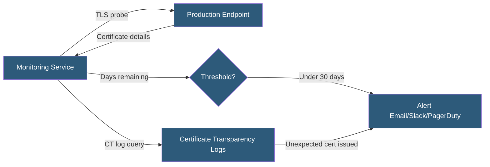

**Category:** SSL/TLS & Certificates
**Difficulty:** Intermediate
**Reading time:** 5 min read

---

Certificate monitoring continuously checks TLS certificates on live endpoints for expiration proximity, configuration errors, and unexpected changes — alerting teams before expirations cause service outages and detecting unauthorized certificate issuance through Certificate Transparency log monitoring.

- **Expiration Alert** — A notification triggered when a certificate's remaining validity falls below a threshold
- **Certificate Transparency (CT) Monitoring** — Watching CT logs for new certificates issued for a domain
- **TLS Probe** — An automated connection to an HTTPS endpoint that inspects certificate details
- **Mismatch Alert** — A notification when the served certificate does not match an expected fingerprint
- **Chain Error** — Detection of incomplete certificate chains or missing intermediates
- **crt.sh** — A public CT log search tool for finding all certificates issued for a domain
- **Monitoring Frequency** — How often probes run; typically every few minutes for critical endpoints

Certificate monitoring services establish TLS connections to configured endpoints, capture the presented certificate, and extract key metadata: expiration date, subject names, issuer, and SPKI hash. This probe runs on a configured schedule — every few minutes for critical services, hourly for less critical endpoints.

Expiration thresholds trigger alerts at multiple intervals — a warning at 60 days, a critical alert at 14 days, and a page at 7 days. Teams configure escalating notification channels: email for early warnings, Slack for team awareness, PagerDuty for on-call escalation as expiration approaches.

CT log monitoring watches publicly visible certificate issuance for configured domains. Every certificate issued by a publicly trusted CA is required to appear in CT logs within a defined timeframe. Services like crt.sh, Censys, or Facebook's Certificate Transparency Monitor provide APIs querying these logs. When a new certificate appears for a monitored domain — especially from an unexpected CA or for an unexpected SAN entry — an alert fires, potentially indicating unauthorized certificate issuance.

Common certificate monitoring tools include UptimeRobot (free tier includes basic SSL monitoring), Datadog (HTTP check with cert expiry metric), Prometheus blackbox exporter (exporting `ssl_cert_not_after` as a metric), and dedicated CLM platforms.

Internal certificates not issued to public CT logs require direct TLS probe monitoring since CT-based discovery does not apply. Internal CA inventories maintained in CLM systems serve as the monitoring source for private PKI.

- Preventing production API outages from unmonitored certificate expiration
- Detecting unauthorized Let's Encrypt certificates issued for company domains
- Monitoring certificates across multi-CDN configurations where different certs may serve different clients
- Validating certificate chain completeness after deployment
- Compliance evidence demonstrating proactive certificate management

| Advantage | Disadvantage |
|-----------|--------------|
| External probes detect issues independent of internal systems | High-frequency probing at scale has CA rate limit implications |
| CT log monitoring detects unauthorized issuance proactively | CT monitoring only covers publicly trusted certificates |
| Alerting thresholds provide advance warning before expiration | False positives from CDN certificates differing from origin |
| Prometheus integration enables metric-based alerting | Discovery of shadow certificates requires network scanning |

- [Certificate Lifecycle Management](certificate-lifecycle-management.md)
- [Automated Certificate Renewal](automated-certificate-renewal.md)
- [OCSP (Online Certificate Status Protocol)](ocsp-online-certificate-status-protocol.md)

---
*Part of the [SSL/TLS & Certificates](index.md) category · [Back to Master Index](../../index.md)*
