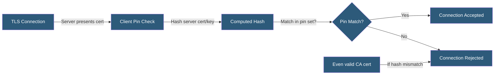

**Category:** SSL/TLS & Certificates
**Difficulty:** Advanced
**Reading time:** 7 min read

---

Certificate pinning is a security technique where a client hard-codes an expected certificate or public key for a specific host, rejecting connections that present any other certificate — even a valid CA-signed one — to defend against CA compromise or man-in-the-middle attacks using fraudulently issued certificates.

- **Pin** — A cryptographic hash or value the client expects to find in the server's certificate or key
- **Certificate Pin** — Pinning the specific certificate's fingerprint
- **Public Key Pin** — Pinning the subject public key's hash, surviving certificate renewal if same key is used
- **SPKI Hash** — Subject Public Key Info hash used for public key pinning (SHA-256 of DER-encoded SPKI)
- **Backup Pin** — A second pin for a certificate not yet deployed, used if the primary pin must be rotated
- **Pin Validation Failure** — The client refusing a connection when no pin matches
- **Static Pinning** — Pins compiled into the application binary

Standard TLS validation accepts any certificate signed by a trusted CA root. If a trusted CA issues a fraudulent certificate for a domain (by error or compromise), a standard TLS client accepts it. Pinning adds a second layer: even a CA-valid certificate is rejected unless it matches the pinned value.

Public key pinning (preferred over certificate pinning) hashes the Subject Public Key Info (SPKI) of the certificate. Since certificates are reissued periodically while the underlying key pair may remain constant, SPKI hashing survives routine certificate renewals without pin updates. The hash is computed as Base64(SHA-256(DER-encoded SPKI)).

Applications implement pinning by comparing the computed SPKI hash against a set of accepted hashes. Mobile applications hardcode pins in the application bundle for the APIs they call. Backup pins for future certificates should always be included — deploying a new certificate for a domain with a pinned application but no matching backup pin causes complete service disruption.

HPKP (HTTP Public Key Pinning) was a header-based mechanism for browser pinning, but was deprecated in 2018 due to its potential for catastrophic mis-deployment — an attacker who compromises a site could set HPKP headers with their own pins, locking legitimate users out indefinitely. Expect-CT replaced HPKP for browser use cases.

Android network security configuration and iOS App Transport Security provide mobile platform-level pinning mechanisms without custom validation code.

- Mobile banking applications defending against corporate proxy MITM
- High-value API clients protecting against CA compromise scenarios
- Enterprise mobile device management where internal CAs must not be bypassed
- Internal microservice communication with mutually authenticated certificates
- IoT devices with long-lived firmware that must trust only specific CAs

| Advantage | Disadvantage |
|-----------|--------------|
| Defends against fraudulently issued CA-signed certificates | Pin rotation errors cause complete service outage |
| SPKI pinning survives certificate renewal with same key | Complicates incident response if certificate must be emergency-replaced |
| Mobile pinning prevents corporate proxy interception | HPKP deprecated due to catastrophic mis-deployment risk |
| Provides defense-in-depth beyond standard CA trust | Reduces flexibility for certificate lifecycle management |

- [HPKP (HTTP Public Key Pinning)](hpkp-http-public-key-pinning.md)
- [Certificate Authority (CA) Hierarchy](certificate-authority-ca-hierarchy.md)
- [SSL/TLS Protocol Versions](ssl-tls-protocol-versions.md)

---
*Part of the [SSL/TLS & Certificates](index.md) category · [Back to Master Index](../../index.md)*
