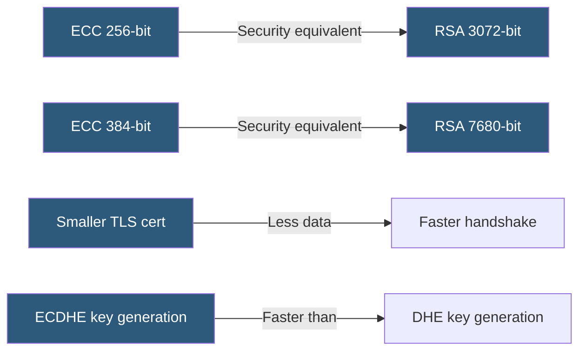

**Category:** SSL/TLS & Certificates
**Difficulty:** Advanced
**Reading time:** 7 min read

---

Elliptic Curve Cryptography provides public key cryptography using algebraic structures of elliptic curves over finite fields, achieving equivalent security to RSA with dramatically smaller key sizes — a 256-bit ECC key provides the security of a 3072-bit RSA key, reducing TLS handshake data and computation.

- **Elliptic Curve** — A mathematical curve defined by `y² = x³ + ax + b` over a finite field
- **ECDH** — Elliptic Curve Diffie-Hellman; key exchange using curve point multiplication
- **ECDSA** — Elliptic Curve Digital Signature Algorithm; signature generation and verification
- **Named Curve** — A standardized curve with defined parameters (P-256, P-384, X25519, X448)
- **P-256 (secp256r1)** — NIST curve widely supported for TLS, also called prime256v1
- **X25519** — Curve25519-based ECDH variant; preferred in TLS 1.3 for its security properties
- **EdDSA (Ed25519)** — Edwards-curve signature algorithm; efficient and resistant to implementation errors

ECC security relies on the Elliptic Curve Discrete Logarithm Problem (ECDLP): given a point P on a curve and the result Q = kP (k scalar multiplications), determining k is computationally infeasible with current algorithms for properly sized curves. This problem is believed harder than integer factorization (RSA's basis), allowing shorter keys to provide equivalent security.

For ECDH key exchange in TLS: both parties agree on a named curve. Each generates a random private key scalar (k) and computes a public key as kG where G is the curve's base point. They exchange public keys and each computes the shared secret as k_a × Q_b = k_b × Q_a (the shared point). The x-coordinate of this point is the shared secret.

For ECDSA signatures: the signer uses their private key and a random nonce to compute a signature (r, s) over the message hash. Verifiers use the signer's public key to confirm the signature without the private key. ECDSA requires careful nonce handling — reusing a nonce with the same key leaks the private key (the Sony PS3 breach occurred this way).

Ed25519 (using the Edwards25519 curve) addresses ECDSA's nonce sensitivity by using deterministic nonce generation. Ed25519 is faster to sign and verify than ECDSA and is now supported in TLS 1.3 certificates.

P-256 is the most widely deployed curve, with hardware acceleration in CPUs (Intel's PCLMULQDQ instruction) and widespread library support. X25519 is preferred for ECDHE key exchange in TLS 1.3.

- Issuing ECDSA certificates for web servers to reduce TLS handshake size
- ECDHE for TLS key exchange providing forward secrecy efficiently
- Ed25519 for code signing, SSH keys, and API authentication
- IoT devices with constrained compute preferring ECC over RSA
- Certificate Authorities moving from RSA to ECDSA intermediates

| Advantage | Disadvantage |
|-----------|--------------|
| Smaller keys achieve equivalent security to larger RSA keys | Some legacy systems and HSMs lack ECC support |
| Faster key generation and signing than RSA at equivalent security | ECDSA requires careful nonce handling; Ed25519 preferred |
| Smaller TLS certificates reduce handshake data | Curve selection matters — weak or backdoored curves are a risk |
| X25519/Ed25519 designed with resistance to implementation errors | Quantum computing threatens ECC and RSA equally |

- [RSA vs ECC Certificates](rsa-vs-ecc-certificates.md)
- [Perfect Forward Secrecy (PFS)](perfect-forward-secrecy-pfs.md)
- [SSL/TLS Cipher Suites](ssl-tls-cipher-suites.md)

---
*Part of the [SSL/TLS & Certificates](index.md) category · [Back to Master Index](../../index.md)*
