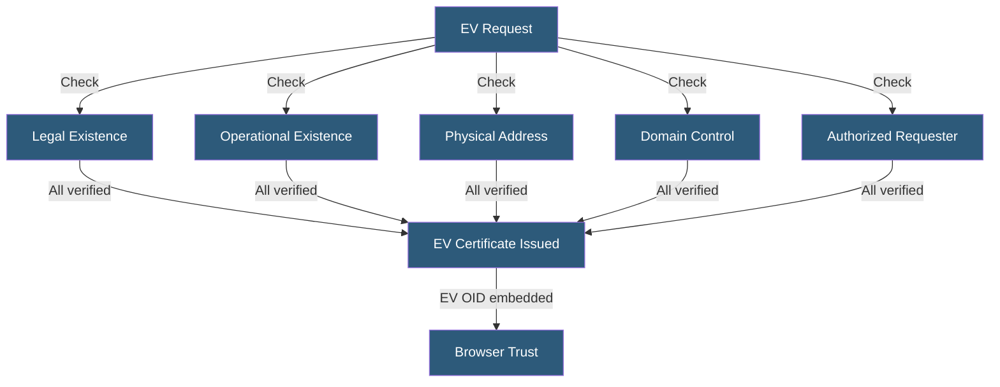

**Category:** SSL/TLS & Certificates
**Difficulty:** Intermediate
**Reading time:** 6 min read

---

Extended Validation certificates apply the most rigorous CA identity verification process, confirming legal entity existence, operational existence, physical address, and authorized requester status. While browsers removed the prominent green bar UI in 2019, EV certificates remain relevant for compliance, fraud deterrence, and regulated industry requirements.

- **EV Guidelines** — CA/Browser Forum's Baseline Requirements for Extended Validation defining vetting standards
- **Legal Entity Verification** — Confirming the organization is legally incorporated and in good standing
- **Operational Existence** — CA verification that the entity has been in business for 3+ years or holds a bank account
- **Physical Address** — Verified through official documents or third-party databases
- **Exclusive Control** — CA confirmation that the requestor is authorized by the entity to obtain certificates
- **EV OID** — Object Identifier in the certificate's Certificate Policies extension identifying it as EV
- **Jurisdiction of Incorporation** — Legal jurisdiction (country, state) embedded in the certificate Subject

EV vetting follows the CA/Browser Forum's EV Guidelines, which standardize the checks CAs must perform. Legal existence verification requires incorporation documents, a certificate of good standing, or a government registry listing. The entity must have been legally in existence for at least three years or provide additional verification of operational credibility.

Physical address verification cross-references government databases, Dun & Bradstreet filings, or official correspondence to confirm the entity's stated address. The authorized requester must provide an authorization letter or corporate resolution demonstrating they have authority to obtain certificates on the organization's behalf.

EV certificates contain a Certificate Policies extension with an EV-specific OID unique to the issuing CA. Browsers check for this OID when deciding whether to display EV treatment. Historically this triggered the green bar UI, but Chrome removed this in Chrome 77 (2019), followed by Firefox and Safari, citing studies showing users did not rely on the green bar for phishing detection.

Despite reduced browser UI prominence, EV certificates retain significance in regulated industries where certificate policies mandating EV remain common, and where the CA's vetting record provides an audit trail for security reviews. EV certificates cannot be obtained by fraudulent actors impersonating an organization as easily as DV certificates.

- Banking and financial services with regulatory certificate requirements
- Healthcare organizations under HIPAA with security policy mandates
- Government websites requiring verifiable organizational identity
- Payment processors managing consumer trust through identity assurance
- Enterprise B2B platforms where security teams audit certificate policies

| Advantage | Disadvantage |
|-----------|--------------|
| Most rigorous identity verification of any certificate type | Browsers no longer display prominent EV UI indicators |
| Provides audit evidence for regulatory compliance reviews | Most expensive certificate type with weeks-long vetting |
| Deters fraudulent certificate issuance to impersonators | Cannot be automated — requires human vetting interaction |
| EV OID provides programmatic verification capability | Vetting must be repeated for each certificate renewal |

- [Organization Validation (OV) Certificates](organization-validation-ov-certificates.md)
- [SSL Certificate Types](ssl-certificate-types.md)
- [Certificate Authority (CA) Hierarchy](certificate-authority-ca-hierarchy.md)

---
*Part of the [SSL/TLS & Certificates](index.md) category · [Back to Master Index](../../index.md)*
