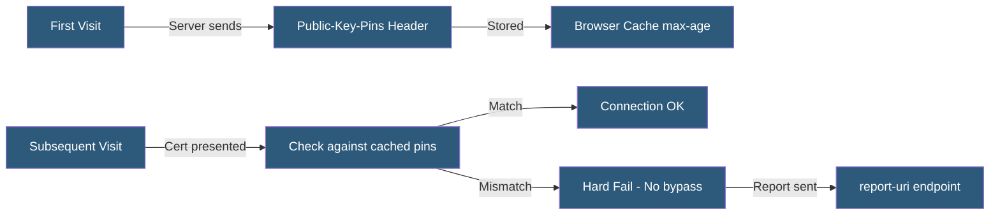

**Category:** SSL/TLS & Certificates
**Difficulty:** Advanced
**Reading time:** 6 min read

---

HTTP Public Key Pinning (HPKP, RFC 7469) was a browser security mechanism allowing servers to instruct browsers to accept only specific certificate public keys for subsequent connections, providing defense against CA compromise. It was deprecated in 2018 due to the catastrophic potential of mis-deployment.

- **Public-Key-Pins Header** — The HTTP response header delivering pins to browsers
- **max-age** — Header directive specifying how long browsers should enforce the pin
- **includeSubDomains** — Directive extending pin enforcement to all subdomains
- **report-uri** — Directive for a URL receiving pin validation failure reports
- **Pin Set** — The collection of accepted SPKI hashes sent in the header
- **Backup Pin** — A required second SPKI hash for a not-yet-deployed certificate
- **HPKP Suicide** — A malicious HPKP deployment with an attacker's pin, blocking legitimate access

HPKP worked by having a server include the `Public-Key-Pins` HTTP response header containing Base64-encoded SHA-256 hashes of the Subject Public Key Info for accepted certificates, a `max-age` value, and optionally `includeSubDomains` and `report-uri` directives.

After a browser received and stored the pins, subsequent connections to the domain within the `max-age` period required the server's certificate chain to include at least one certificate whose SPKI hash matched a stored pin. If no match was found, the browser rejected the connection with a hard error that no user click-through could bypass — stronger than standard certificate errors.

The `report-uri` directive allowed collecting pin validation failures, enabling monitoring for potential attack attempts or configuration errors before they caused outages. A report-only variant `Public-Key-Pins-Report-Only` sent reports without enforcing rejections.

HPKP's critical vulnerability was the potential for "HPKP Suicide" — an attacker who briefly compromised a website could set HPKP headers pinning their own certificate with a long `max-age`, making the legitimate site inaccessible to all browsers that received the malicious header. Recovery required either serving a new valid HPKP header (impossible since browsers reject non-pinned connections) or waiting for max-age to expire.

Chrome 67 (May 2018) removed HPKP support. The replacement mechanisms are Certificate Transparency enforcement via Expect-CT header, and Certificate Authority Authorization (CAA) DNS records.

- Historical reference for understanding why Expect-CT replaced HPKP
- Auditing legacy deployments still sending HPKP headers
- Understanding browser security header evolution
- Security research on header-based trust delegation mechanisms
- PKI policy documentation requiring awareness of deprecated controls

| Advantage | Disadvantage |
|-----------|--------------|
| Provided strong browser-level defense against CA compromise | Mis-deployment could permanently lock out all visitors |
| Hard enforcement with no user bypass option | No recovery mechanism if pins expired or were wrong |
| Report-only mode enabled gradual rollout testing | Deprecated and removed from all major browsers |
| SPKI hashing supports key reuse across certificate renewals | Replaced by Certificate Transparency, which is far safer |

- [Certificate Pinning](certificate-pinning.md)
- [OCSP (Online Certificate Status Protocol)](ocsp-online-certificate-status-protocol.md)
- [Certificate Authority (CA) Hierarchy](certificate-authority-ca-hierarchy.md)

---
*Part of the [SSL/TLS & Certificates](index.md) category · [Back to Master Index](../../index.md)*
