**Category:** SSL/TLS & Certificates
**Difficulty:** Intermediate
**Reading time:** 6 min read

---

Let's Encrypt is a free, automated, and open Certificate Authority operated by the Internet Security Research Group (ISRG) that issues 90-day DV certificates via the ACME protocol, enabling zero-cost automated HTTPS for the majority of internet-facing web servers.

- **ACME Client** — Software implementing the ACME protocol to request and renew certificates automatically
- **Certbot** — The EFF-maintained reference ACME client for Apache, Nginx, and standalone use
- **90-Day Validity** — Let's Encrypt's maximum certificate validity, designed to encourage automation
- **Rate Limits** — Restrictions on certificate issuance per domain to prevent abuse
- **Staging Environment** — Let's Encrypt's test CA for development without consuming rate limits
- **Account Key** — An RSA or ECDSA key pair identifying the ACME account with the CA
- **CAA Record** — DNS record that can restrict certificate issuance to Let's Encrypt only

```mermaid
graph LR
    A[ACME Client] -->|New order| B[Let's Encrypt CA]
    B -->|HTTP-01 or DNS-01 challenge| C[Challenge Issued]
    C -->|Complete challenge| D[Server or DNS]
    D -->|CA validates| E[Challenge Verified]
    E -->|CSR submitted| F[Certificate Issued]
    F -->|Install + schedule renewal| G[Web Server]
    G -->|Renew before 60 days| A
    style A fill:#2d5a7a,color:#fff
    style B fill:#2d5a7a,color:#fff
    style C fill:#2d5a7a,color:#fff
    style D fill:#2d5a7a,color:#fff
    style E fill:#2d5a7a,color:#fff
    style F fill:#2d5a7a,color:#fff
    style G fill:#2d5a7a,color:#fff
```

Let's Encrypt certificates are obtained and renewed via the ACME protocol without human intervention. Certbot, the most common ACME client, integrates with Apache, Nginx, HAProxy, and other servers through plugins that handle challenge placement and automatic web server configuration.

Upon first run, Certbot registers an ACME account with Let's Encrypt using a locally generated key pair. It submits a certificate order specifying the domain names, and Let's Encrypt responds with an authorization challenge per domain. Certbot completes the HTTP-01 challenge by writing a file at `/.well-known/acme-challenge/{token}`, or the DNS-01 challenge by calling a DNS provider API to add a TXT record. Let's Encrypt validates the challenge from its servers.

After successful validation, Certbot generates a certificate signing request (CSR) containing the domain names and submits it. Let's Encrypt signs the CSR with its intermediate CA key and returns the certificate chain. Certbot saves the certificate, chain, and private key, then configures the web server to use them.

The 90-day validity is intentional — it forces automation of renewal and reduces the window of exposure if a certificate or key is compromised. Certbot schedules renewal checks twice daily via systemd timer or cron, renewing automatically when a certificate is within 30 days of expiration.

Rate limits include 50 new certificates per registered domain per week, preventing abuse. Let's Encrypt's staging environment issues from an untrusted test root, allowing development and CI testing without consuming production rate limits.

- Automated HTTPS for all web server types without certificate costs
- Wildcard certificate automation via DNS-01 challenge with DNS provider APIs
- Let's Encrypt integration built into cloud platforms (Netlify, Caddy, Traefik)
- High-volume SaaS platforms issuing per-customer subdomain certificates
- Replacing expired commercial certificates with fully automated free alternatives

| Advantage | Disadvantage |
|-----------|--------------|
| Free DV certificates with no commercial CA cost | 90-day expiry requires automation or manual intervention every 2 months |
| Fully automated issuance and renewal via ACME | Rate limits can affect high-volume domain issuance |
| Wildcard support via DNS-01 challenge | DNS-01 requires DNS provider API access for automation |
| Widely supported by hosting platforms and web servers | DV only — no OV or EV certificates |

- [ACME Protocol Implementation](acme-protocol-implementation.md)
- [Domain Validation (DV) Certificates](domain-validation-dv-certificates.md)
- [Automated Certificate Renewal](automated-certificate-renewal.md)

---
*Part of the [SSL/TLS & Certificates](index.md) category · [Back to Master Index](../../index.md)*
