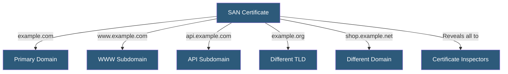

**Category:** SSL/TLS & Certificates
**Difficulty:** Intermediate
**Reading time:** 5 min read

---

Multi-domain certificates use the Subject Alternative Names (SAN) X.509 extension to list multiple distinct hostnames in a single certificate, covering unrelated domains and subdomains without requiring separate certificates for each, enabling consolidated certificate management across diverse domain portfolios.

- **Subject Alternative Names (SAN)** — An X.509 certificate extension listing additional hostnames the certificate is valid for
- **Common Name (CN)** — The primary hostname in the certificate Subject; browsers now use SANs for matching
- **UCC (Unified Communications Certificate)** — Microsoft's marketing term for SAN certificates used in Exchange and Skype
- **Mixed Validation** — Some SAN certificates can include both DV and OV validated domains
- **Certificate Enumeration** — The exposure of all covered domains to anyone inspecting the certificate
- **SAN Limit** — CAs enforce a maximum number of SANs per certificate (typically 100–250)
- **FQDN** — Fully Qualified Domain Name; each SAN entry is a specific FQDN

SAN certificates are standard X.509 certificates where the `subjectAltName` extension lists additional hostnames. Modern browsers exclusively use SAN entries for hostname matching — the Common Name field is ignored for validation purposes. A certificate must include the primary hostname in both CN and SAN, plus any additional hostnames in SAN.

SAN entries can be exact hostnames (`api.example.com`), wildcard patterns (`*.example.com`), or IP addresses. A SAN certificate can combine a wildcard for one domain (`*.example.com`) with specific hostnames for unrelated domains (`partner.example.org`), creating flexible coverage in one certificate.

Each domain in a SAN certificate requires independent domain control validation. For multi-domain certificates covering domains under different registrant ownership, each domain owner must complete their respective DCV. CAs often allow the primary domain owner to authorize SANs through a delegated verification mechanism.

Privacy consideration: all SAN entries are visible to anyone who examines the certificate, including certificate transparency logs where all issued certificates are publicly recorded. Organizations with confidential internal service names in SAN certificates should be aware these names are publicly enumerated.

Updating SAN certificates requires reissuing the entire certificate, even to add or remove a single domain. This means SAN management at scale — adding customers to a shared certificate — involves periodic certificate renewals.

- Organizations securing multiple brands or TLDs under one certificate
- Microsoft Exchange and Skype for Business deployments with UCC certificates
- CDN platforms securing multiple customer domains on shared infrastructure
- Startups consolidating certificate management across multiple product domains
- Testing environments with several hostnames covered by a single certificate

| Advantage | Disadvantage |
|-----------|--------------|
| Single certificate covers unrelated domains | All covered domain names visible in CT logs and certificate |
| Simplifies certificate management for multi-domain portfolios | Adding/removing SANs requires full certificate reissuance |
| Can combine wildcard and explicit hostname entries | SAN limit per certificate (typically 100–250 entries) |
| Reduces certificate monitoring and renewal overhead | Domain control validation required for every SAN entry |

- [Wildcard SSL Certificates](wildcard-ssl-certificates.md)
- [SSL Certificate Types](ssl-certificate-types.md)
- [Certificate Lifecycle Management](certificate-lifecycle-management.md)

---
*Part of the [SSL/TLS & Certificates](index.md) category · [Back to Master Index](../../index.md)*
