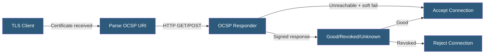

**Category:** SSL/TLS & Certificates
**Difficulty:** Intermediate
**Reading time:** 6 min read

---

OCSP is a protocol (RFC 6960) for real-time certificate revocation checking, allowing TLS clients to query a CA-operated responder for a specific certificate's revocation status — offering fresher revocation data than Certificate Revocation Lists (CRLs) while introducing latency and privacy concerns.

- **OCSP Responder** — A CA-operated HTTP server answering revocation queries with signed responses
- **OCSP Request** — A client query containing the serial number of the certificate to check
- **OCSP Response** — A CA-signed message stating the certificate is good, revoked, or unknown
- **OCSP URI** — The URL in a certificate's Authority Information Access extension pointing to the responder
- **Soft Fail** — Client behavior accepting the certificate if the OCSP responder is unreachable
- **Hard Fail** — Client behavior rejecting the certificate if OCSP cannot be reached
- **OCSP Stapling** — A TLS extension allowing servers to include pre-fetched OCSP responses

When a client receives a certificate during a TLS handshake, it may check revocation status by reading the Authority Information Access (AIA) extension, which contains the OCSP responder URL. The client constructs an OCSP request containing the issuing CA name, the certificate's serial number, and a hash of the certificate's public key — uniquely identifying the certificate without revealing the subject.

The OCSP responder is a CA-operated service that answers with a signed response stating the certificate's status. OCSP responses are signed by the CA or a delegated OCSP signing key, allowing clients to verify authenticity. Responses include a `thisUpdate` and `nextUpdate` timestamp defining the response's validity window. Clients cache responses until `nextUpdate`.

The privacy problem with OCSP is that the client reveals to the CA which certificate (and thus which website) it is connecting to. Every TLS connection to a non-cached certificate generates an observable query to the CA's OCSP responder.

Soft fail is the default behavior in most TLS implementations — if the OCSP responder is unreachable (due to CA outage, network issues, or blocking), the client proceeds with the connection. This degrades OCSP to best-effort revocation checking rather than a hard security control.

OCSP stapling (RFC 6066) addresses both latency and privacy by having the server fetch and cache the OCSP response, then include it in the TLS handshake. Clients verify the stapled response's signature without contacting the CA directly.

- Certificate revocation checking in TLS library implementations
- Diagnosing connection failures caused by OCSP responder timeouts
- Implementing OCSP stapling on web servers for performance and privacy
- Monitoring certificate revocation after key compromise incidents
- Compliance frameworks requiring real-time revocation checking

| Advantage | Disadvantage |
|-----------|--------------|
| Real-time revocation status fresher than CRL downloads | Adds latency to TLS handshake for uncached certificates |
| Single certificate query rather than full CRL download | Soft fail behavior reduces effectiveness as a hard control |
| CA-signed responses allow offline verification | Reveals browsing behavior to CA OCSP responders |
| Widely supported in browsers and TLS libraries | OCSP responder availability becomes a dependency |

- [OCSP Stapling](ocsp-stapling.md)
- [Certificate Revocation Lists (CRL)](certificate-revocation-lists-crl.md)
- [Certificate Lifecycle Management](certificate-lifecycle-management.md)

---
*Part of the [SSL/TLS & Certificates](index.md) category · [Back to Master Index](../../index.md)*
