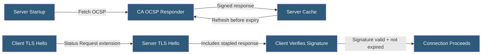

**Category:** SSL/TLS & Certificates
**Difficulty:** Intermediate
**Reading time:** 6 min read

---

OCSP stapling allows web servers to proactively fetch and cache their own OCSP revocation response from the CA, then include (staple) it in the TLS handshake, eliminating client-to-CA OCSP queries, reducing handshake latency, and preserving client privacy.

- **Stapled Response** — A CA-signed OCSP response cached by the server and included in TLS handshakes
- **Certificate Status Request TLS Extension** — The TLS extension (RFC 6066) clients use to signal OCSP stapling support
- **OCSP Must-Staple** — An optional certificate extension requiring clients to reject connections without a valid stapled response
- **Staple Cache** — Server-side storage of the current OCSP response, refreshed before expiration
- **Response Validity Window** — The `thisUpdate` to `nextUpdate` period within which a stapled response is valid
- **Multi-Stapling** — An extension supporting stapling for multiple certificates in a chain (RFC 6961)
- **Nginx/Apache Configuration** — Server software requiring explicit configuration to enable stapling

OCSP stapling moves the OCSP query responsibility from the client to the server. During TLS client hello, a client that supports stapling includes the `status_request` TLS extension. The server, if configured for stapling, includes its cached OCSP response in the server hello extension data.

The server fetches and caches the OCSP response during startup or when serving a certificate, refreshing it before the `nextUpdate` timestamp expires. The cached response remains valid for its stated period (typically 24–48 hours for Let's Encrypt), so the server only contacts the CA responder once per validity window rather than per client connection.

The client verifies the stapled response by checking the CA's signature on the response and confirming the response's timestamps are valid. Since the response is signed by the CA, a compromised server cannot forge a valid stapled response claiming a revoked certificate is good.

OCSP Must-Staple is a certificate extension (`id-pe-tlsfeature`) that instructs clients to reject connections that do not include a valid stapled response. This hardens the revocation check from soft-fail (proceed if OCSP unreachable) to hard-fail (require staple). However, browser support for Must-Staple enforcement is limited.

Enabling OCSP stapling in Nginx requires `ssl_stapling on;` and `ssl_stapling_verify on;`, along with the CA's certificate chain for response signature verification.

- High-traffic HTTPS servers where per-connection OCSP latency is unacceptable
- Privacy-sensitive applications where client OCSP queries reveal browsing behavior
- Servers with deployed OCSP Must-Staple certificates requiring guaranteed stapling
- Environments where OCSP responder availability is unreliable
- Compliance requirements for real-time revocation checking with low latency impact

| Advantage | Disadvantage |
|-----------|--------------|
| Eliminates per-connection OCSP latency for clients | Server must be configured explicitly; not enabled by default |
| Preserves client privacy — CA does not see client queries | Stapled response may be stale up to response validity window |
| Reduces load on CA OCSP responders | Requires CA chain certificates available to server for verification |
| Server cache shared across all connections to same server | OCSP Must-Staple has limited browser enforcement support |

- [OCSP (Online Certificate Status Protocol)](ocsp-online-certificate-status-protocol.md)
- [Certificate Revocation Lists (CRL)](certificate-revocation-lists-crl.md)
- [SSL/TLS Performance Optimization](ssl-tls-performance-optimization.md)

---
*Part of the [SSL/TLS & Certificates](index.md) category · [Back to Master Index](../../index.md)*
