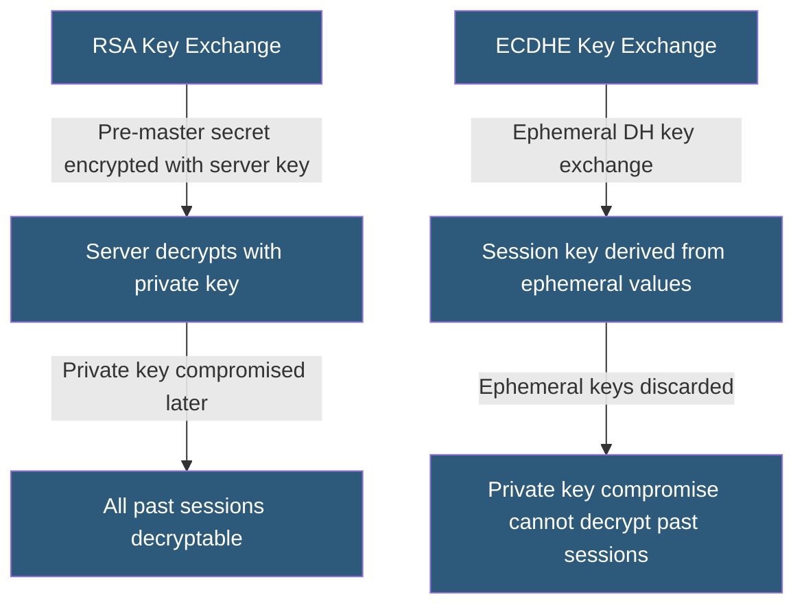

**Category:** SSL/TLS & Certificates
**Difficulty:** Intermediate
**Reading time:** 6 min read

---

Perfect Forward Secrecy is a TLS property ensuring that session keys are generated freshly per connection using ephemeral Diffie-Hellman key exchange, so that compromising a server's long-term private key cannot decrypt previously recorded sessions.

- **Ephemeral Key Pair** — A temporary DH key pair generated for each TLS session and discarded afterward
- **ECDHE** — Elliptic Curve Diffie-Hellman Ephemeral; the preferred PFS key exchange
- **DHE** — Diffie-Hellman Ephemeral; PFS via finite-field DH, less efficient than ECDHE
- **RSA Key Exchange** — Non-PFS method where the pre-master secret is encrypted with the server's certificate key
- **Session Key** — The symmetric encryption key derived for a specific TLS session
- **Long-Term Private Key** — The server's certificate private key; static across many connections
- **Passive Decryption** — An attacker recording ciphertext to decrypt later if the private key is obtained

In traditional RSA key exchange (TLS 1.2 without PFS), the client generates a pre-master secret, encrypts it with the server's certificate public key, and sends it. The server decrypts it with its private key. Both sides derive the session key from this pre-master secret. If an attacker has recorded the encrypted traffic and later obtains the server's private key — through a server compromise, a court order, or key theft — they can decrypt all sessions that used RSA key exchange.

With PFS via ECDHE, the server generates a temporary ECDH key pair specifically for this session. The client and server perform an ECDH key agreement using the server's ephemeral public key and the client's ECDH parameters, producing a shared secret neither side transmitted in cleartext. The server signs its ephemeral public key with its long-term certificate key, providing authentication.

After the session ends, the ephemeral key pair is discarded. Even if the server's certificate private key is subsequently compromised, past sessions cannot be decrypted — the ephemeral keys no longer exist.

TLS 1.3 mandates PFS for all connections by requiring ECDHE or DHE in every handshake and prohibiting RSA key exchange entirely. TLS 1.2 requires explicit configuration to prefer ECDHE cipher suites over RSA key exchange suites.

The performance cost of ephemeral key generation is modest on modern hardware with ECC support but was historically significant. ECDHE provides equivalent security to 3072-bit RSA at much smaller key sizes and faster computation.

- Protecting communications from retroactive decryption by state actors
- Compliance with NSA Suite B and CNSA cryptographic requirements
- Encrypting high-value communications (financial transactions, medical records)
- TLS configurations for long-term data confidentiality requirements
- Mutual TLS in microservices where past session confidentiality matters

| Advantage | Disadvantage |
|-----------|--------------|
| Past sessions remain confidential even if private key is compromised | Slightly higher CPU overhead than RSA key exchange (minimal on modern hardware) |
| Mandatory in TLS 1.3 — automatic protection for new deployments | Disabling RSA key exchange may break legacy clients on TLS 1.2 |
| ECDHE provides PFS with smaller keys than DHE | DHE requires careful parameter selection (1024-bit DHE is broken) |
| Protects against recorded-traffic decrypt-later attack scenarios | Ephemeral keys prevent certain debugging capabilities |

- [SSL/TLS Cipher Suites](ssl-tls-cipher-suites.md)
- [TLS 1.2 vs TLS 1.3](tls-1-2-vs-tls-1-3.md)
- [Elliptic Curve Cryptography (ECC)](elliptic-curve-cryptography-ecc.md)

---
*Part of the [SSL/TLS & Certificates](index.md) category · [Back to Master Index](../../index.md)*
