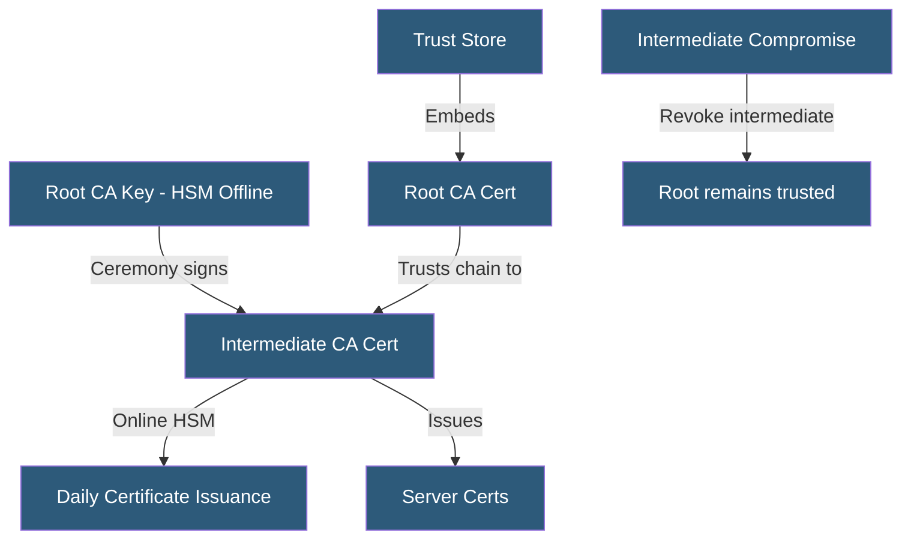

**Category:** SSL/TLS & Certificates
**Difficulty:** Intermediate
**Reading time:** 5 min read

---

Root certificates are self-signed trust anchors embedded in operating systems and browsers, while intermediate certificates are CA-signed certificates that bridge between offline root keys and the online issuance infrastructure — providing both operational security and traceable certificate authority.

- **Root Certificate** — A CA certificate signed by its own private key; trusted by inclusion in a trust store
- **Offline Root** — A root CA key kept disconnected from networks, operated in ceremonies
- **Root CA Program** — Browser/OS vendor requirements for maintaining root CA trust store inclusion
- **Intermediate Certificate** — Signed by root, used for issuing end-entity certificates daily
- **CA Ceremony** — A formal, audited event where root CA keys are used, with multiple witnesses
- **Root Store Program** — Mozilla, Microsoft, Apple, and Google programs controlling root trust
- **Root Key Rollover** — The process of retiring an old root and transitioning trust to a new one

Root CA private keys represent the ultimate trust anchor. Compromising a root key would allow an attacker to issue trusted certificates for any domain. To protect against this, root CA keys are stored on Hardware Security Modules (HSMs) within physically secured facilities with dual-control access. Operations using root keys — signing intermediate certificates — occur during formal CA ceremonies with multiple witnesses, video recording, and audit trails.

Root certificates have long validity periods (10–25 years) since they are rarely replaced. The root CA certificate is self-signed: its Issuer and Subject fields are identical, and its signature is verified using its own public key. Root certificates are distributed through trust store updates — Mozilla's NSS, Microsoft Root Store, Apple Root Certificate Program, and Google's Chrome Root Store.

Intermediate certificates have shorter validity periods (3–10 years) and their keys are kept online in HSMs to support daily issuance. If an intermediate CA is compromised, the CA can revoke the intermediate certificate (publishing its serial number in a CRL or OCSP response), preventing further validation of certificates it issued. The root remains unaffected.

Cross-certification extends trust: Let's Encrypt's root (ISRG Root X1) was cross-signed by IdenTrust's root for years, allowing ISRG Root X1 to be trusted on Android devices that included IdenTrust but not ISRG Root X1 in their trust store.

- Enterprise private CA deployment with offline root HSMs
- Understanding browser incompatibility when Let's Encrypt's root is not trusted
- Diagnosing trust errors from intermediate certificate expiration
- Root store program compliance for CAs seeking public trust
- Planning PKI hierarchy for IoT device certificate management

| Advantage | Disadvantage |
|-----------|--------------|
| Offline roots protect ultimate trust anchor from online attacks | Root distribution through OS/browser update cycles is slow |
| Intermediate revocation contains compromise without root impact | New roots take years to reach sufficient device penetration |
| Cross-certification extends reach to older trust stores | Root ceremony operational overhead is significant |
| Long root validity reduces update frequency | Intermediate expiration can disrupt service if unmonitored |

- [Certificate Authority (CA) Hierarchy](certificate-authority-ca-hierarchy.md)
- [Certificate Chain of Trust](certificate-chain-of-trust.md)
- [Hardware Security Modules (HSM)](hardware-security-modules-hsm.md)

---
*Part of the [SSL/TLS & Certificates](index.md) category · [Back to Master Index](../../index.md)*
