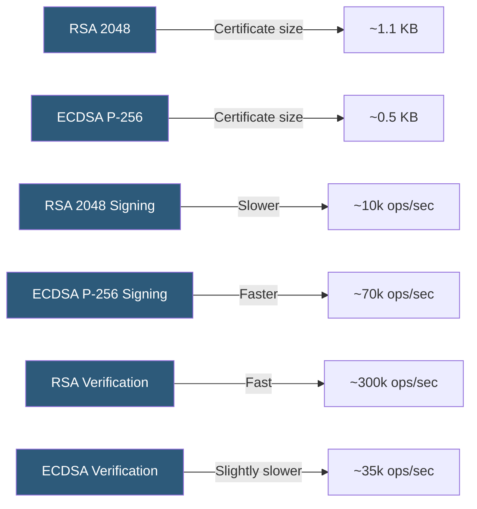

**Category:** SSL/TLS & Certificates
**Difficulty:** Intermediate
**Reading time:** 6 min read

---

RSA and ECDSA are the two primary certificate types in web PKI, differing in the underlying cryptographic algorithm, key size, performance characteristics, and compatibility. Most modern servers support ECDSA certificates with RSA fallback for compatibility with older clients.

- **RSA Certificate** — A certificate whose public key uses the RSA algorithm; 2048, 3072, or 4096-bit keys
- **ECDSA Certificate** — A certificate using an elliptic curve key pair; typically P-256 or P-384
- **Dual-Certificate Configuration** — Serving both an ECDSA and RSA certificate, selecting based on client capability
- **Key Size vs Security** — 256-bit ECDSA provides equivalent security to 3072-bit RSA
- **Handshake Overhead** — The CPU and bytes added to TLS handshakes by certificate size and signature operations
- **Client Compatibility** — Older clients (IE on XP, very old Android) may not support ECDSA
- **CA Support** — All major CAs now offer both RSA and ECDSA certificate issuance

RSA certificates use an RSA key pair where the public modulus is a product of two large primes. Security relies on the difficulty of factoring the modulus. RSA signing (the expensive operation, performed by the server) involves modular exponentiation with the private key. RSA verification (client-side) is fast because the public exponent is typically small (65537). RSA keys must be large (2048+ bits minimum, 3072 for post-2030 security) to resist factoring attacks.

ECDSA certificates use an elliptic curve key pair. Signing involves elliptic curve scalar multiplication with the private key and a random nonce. Verification requires two scalar multiplications. Signing is faster than RSA signing; verification is slightly slower than RSA verification. However, at equivalent security levels, ECDSA keys are ~6-10x smaller than RSA keys, producing smaller certificates and faster handshakes.

Dual-certificate configurations serve both simultaneously: Nginx and HAProxy can load an ECDSA certificate and an RSA certificate for the same virtual host. When a client presents ECDSA cipher suites, the ECDSA certificate is selected; RSA clients receive the RSA certificate. This maximizes compatibility while allowing modern clients to benefit from the smaller, faster ECDSA path.

The major compatibility concern for ECDSA is legacy clients: Android 2.x, IE on Windows XP, and Java 6 lack P-256 support. These clients require RSA certificates, motivating dual-cert configurations rather than a full ECDSA migration.

- High-traffic APIs prioritizing TLS handshake throughput using ECDSA
- Legacy system support requiring RSA certificates with dual-cert fallback
- IoT device authentication with space-constrained certificates
- Enterprise PKI transitioning from RSA 2048 to ECDSA P-256
- PCI DSS or NIST-compliant systems specifying minimum key sizes

| Advantage | Disadvantage |
|-----------|--------------|
| ECDSA: smaller certificates and faster server signing | ECDSA: verification slightly slower than RSA |
| RSA: universal client compatibility including legacy systems | RSA: larger certificates increase TLS handshake bytes |
| Dual-cert configuration supports both without compromise | Dual-cert adds operational complexity for certificate management |
| ECDSA P-256 hardware acceleration available in modern CPUs | ECDSA nonce reuse vulnerability in naive implementations |

- [Elliptic Curve Cryptography (ECC)](elliptic-curve-cryptography-ecc.md)
- [SSL/TLS Cipher Suites](ssl-tls-cipher-suites.md)
- [Hardware Security Modules (HSM)](hardware-security-modules-hsm.md)

---
*Part of the [SSL/TLS & Certificates](index.md) category · [Back to Master Index](../../index.md)*
