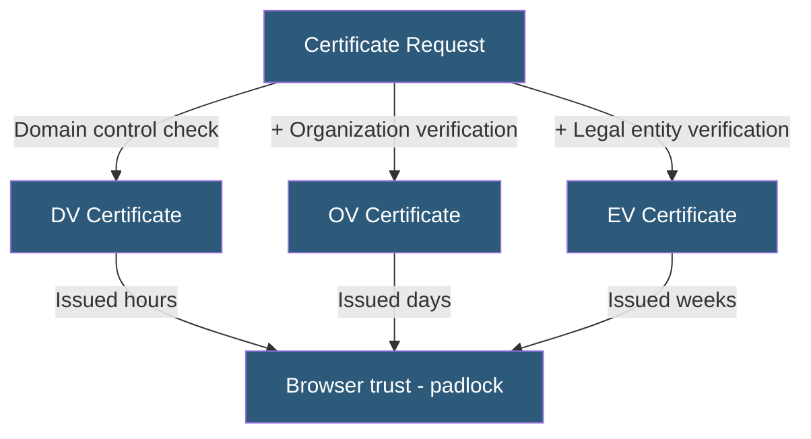

**Category:** SSL/TLS & Certificates
**Difficulty:** Beginner
**Reading time:** 5 min read

---

SSL/TLS certificates are classified by validation level (DV, OV, EV), coverage scope (single-domain, wildcard, multi-domain SAN), and purpose (server authentication, code signing, client authentication). Selecting the correct type depends on the site's security requirements, browser trust indicators, and operational scope.

- **DV (Domain Validation)** — Certificate proving domain control; no organization identity verification
- **OV (Organization Validation)** — Certificate including verified organization name after CA identity check
- **EV (Extended Validation)** — Highest verification level; CA verifies legal organization existence
- **Wildcard** — Covers a domain and all direct subdomains (`*.example.com`)
- **SAN (Subject Alternative Name)** — Multi-domain certificate covering multiple distinct hostnames
- **Self-Signed** — A certificate signed by its own private key; not trusted by browsers
- **Root Certificate** — A CA's self-signed certificate embedded in browser/OS trust stores

Certificate types differ in what identity information the Certificate Authority (CA) verifies before issuance. DV certificates require only proof of domain control, typically via DNS record placement, HTTP file challenge, or email to registered domain contacts. Verification is automated, enabling issuance within minutes. Let's Encrypt issues exclusively DV certificates.

OV certificates require the CA to verify the requesting organization's legal existence through government database checks, phone verification, or physical address validation. The organization name and country are embedded in the certificate's Subject field, visible in browser certificate details. OV issuance typically takes one to three business days.

EV certificates apply the most rigorous verification — legal entity existence, operational existence, physical address, and authorized signer validation. Historically, EV triggered a green address bar in browsers, though major browsers removed this visual treatment in 2019. EV certificates remain valuable for industries where the additional verification provides compliance or trust assurance.

Wildcard certificates cover `*.example.com` — one level of subdomains — but not `*.*.example.com`. Wildcard private keys are shared across all subdomains, creating a single point of compromise risk. Multi-domain (SAN) certificates list specific additional hostnames in the Subject Alternative Names extension, covering unrelated domains under one certificate.

- DV for developer APIs, internal tools, and automated Let's Encrypt issuance
- OV for business-facing web applications where organization identity matters
- EV for banking, payment processors, and government portals with strict identity requirements
- Wildcard for platforms hosting many customer subdomains from one certificate
- SAN for organizations managing multiple domains under one certificate

| Advantage | Disadvantage |
|-----------|--------------|
| DV automated issuance enables zero-touch certificate management | DV provides no organization identity assurance |
| OV adds verifiable organization identity in certificate details | OV/EV manual verification delays issuance |
| Wildcard reduces certificate sprawl for subdomain-heavy platforms | Wildcard key compromise affects all covered subdomains |
| SAN covers multiple domains in one certificate | SAN certificates reveal all covered domain names to observers |

- [Domain Validation (DV) Certificates](domain-validation-dv-certificates.md)
- [Wildcard SSL Certificates](wildcard-ssl-certificates.md)
- [Let's Encrypt Automation](lets-encrypt-automation.md)

---
*Part of the [SSL/TLS & Certificates](index.md) category · [Back to Master Index](../../index.md)*
