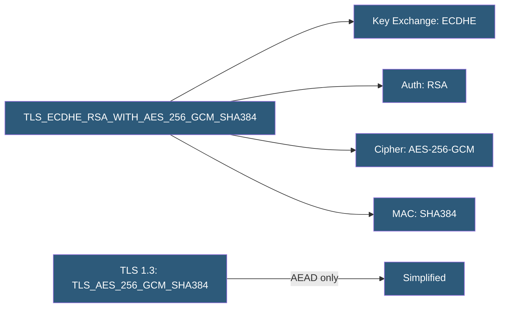

**Category:** SSL/TLS & Certificates
**Difficulty:** Advanced
**Reading time:** 7 min read

---

TLS cipher suites are named combinations of cryptographic algorithms negotiated during the TLS handshake, specifying the key exchange method, authentication algorithm, bulk encryption cipher, and MAC function. Proper cipher suite configuration balances security, performance, and compatibility.

- **Key Exchange** — Algorithm for establishing a shared secret (ECDHE, DHE, RSA)
- **Authentication** — Algorithm verifying the server's identity (RSA, ECDSA, DSS)
- **Bulk Encryption** — Symmetric cipher for session data (AES-GCM, AES-CBC, ChaCha20)
- **MAC / AEAD** — Integrity protection; AEAD modes combine encryption and authentication
- **Cipher Suite Name** — Notation like `TLS_ECDHE_RSA_WITH_AES_256_GCM_SHA384`
- **Forward Secrecy** — Ephemeral key exchange (ECDHE/DHE) preventing retroactive decryption
- **AEAD** — Authenticated Encryption with Associated Data; AES-GCM and ChaCha20-Poly1305

In TLS 1.2, cipher suite names encode four algorithm choices. The key exchange algorithm (ECDHE — Elliptic Curve Diffie-Hellman Ephemeral, or DHE — Diffie-Hellman Ephemeral) establishes a fresh shared secret per session, providing forward secrecy. RSA key exchange (without DHE/ECDHE) lacks forward secrecy and is deprecated.

The authentication component identifies the certificate type the server must present: RSA for RSA certificates, ECDSA for elliptic curve certificates. Cipher suites with `_RSA_` in the authentication position require the server to have an RSA certificate; `_ECDSA_` requires an ECDSA certificate.

Bulk encryption handles session data. AES-256-GCM and AES-128-GCM are AEAD modes providing both encryption and integrity checking in a single pass, more efficient than the older AES-CBC modes which required a separate HMAC. ChaCha20-Poly1305 is an AEAD alternative optimized for software implementations without hardware AES acceleration, commonly preferred on mobile and IoT.

TLS 1.3 simplifies cipher suite naming by removing key exchange and authentication from the notation — these are handled via separate mechanisms. TLS 1.3 defines only five cipher suites: `TLS_AES_128_GCM_SHA256`, `TLS_AES_256_GCM_SHA384`, `TLS_CHACHA20_POLY1305_SHA256`, `TLS_AES_128_CCM_SHA256`, and `TLS_AES_128_CCM_8_SHA256`.

Recommended configurations from Mozilla SSL Configuration Generator provide `modern`, `intermediate`, and `old` profiles balancing security against compatibility with legacy clients.

- Configuring Nginx/Apache cipher suites to comply with PCI DSS or NIST guidelines
- Auditing web server TLS configuration with SSL Labs or testssl.sh
- Enabling ChaCha20 for mobile API clients without hardware AES acceleration
- Removing CBC cipher suites vulnerable to BEAST and LUCKY13 attacks
- Selecting cipher suites for TLS mutual authentication in microservices

| Advantage | Disadvantage |
|-----------|--------------|
| AEAD suites combine encryption and integrity more efficiently than CBC+MAC | Restrictive cipher suite configuration breaks legacy client compatibility |
| ChaCha20-Poly1305 performs better than AES on software-only implementations | ECDHE has higher CPU cost than RSA key exchange (offset by hardware support) |
| TLS 1.3 eliminates weak cipher suite options entirely | AES-256 provides marginal security improvement over AES-128 at higher CPU cost |
| Forward secrecy via ECDHE protects past sessions from future key compromise | Larger DHE parameters (4096-bit) have significant performance impact |

- [Perfect Forward Secrecy (PFS)](perfect-forward-secrecy-pfs.md)
- [TLS 1.2 vs TLS 1.3](tls-1-2-vs-tls-1-3.md)
- [SSL/TLS Performance Optimization](ssl-tls-performance-optimization.md)

---
*Part of the [SSL/TLS & Certificates](index.md) category · [Back to Master Index](../../index.md)*
