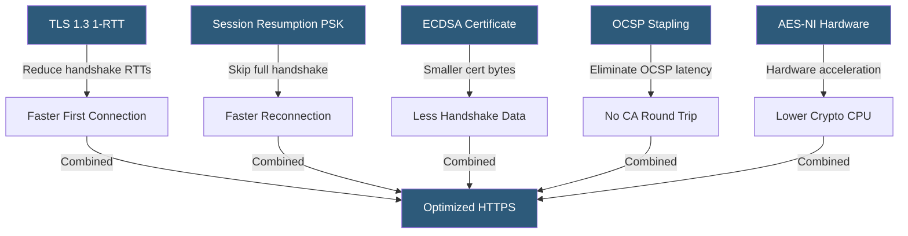

**Category:** SSL/TLS & Certificates
**Difficulty:** Advanced
**Reading time:** 7 min read

---

TLS performance optimization reduces the computational and latency overhead of HTTPS by leveraging TLS 1.3's 1-RTT handshake, session resumption, OCSP stapling, ECDSA certificates, hardware acceleration, and False Start to minimize the cost of encrypted connections at scale.

- **Handshake Latency** — The round trips required before encrypted application data can flow
- **False Start** — A TLS technique sending application data before handshake completion verification
- **Session Resumption** — Reusing negotiated parameters from a prior session to skip a full handshake
- **TLS Hardware Offload** — Using dedicated cryptographic accelerator hardware or CPU AES-NI instructions
- **AES-NI** — Intel/AMD CPU instruction set extensions for hardware-accelerated AES operations
- **TCP Fast Open** — OS-level optimization sending data in the TCP SYN packet, reducing RTT
- **Connection Coalescing** — Reusing a TLS connection for multiple HTTP/2 requests to the same IP

TLS performance has multiple dimensions: handshake latency (how many RTTs before data flows), computation overhead (CPU cycles per connection), and data overhead (bytes added per handshake).

Handshake latency is minimized by enabling TLS 1.3 (1 RTT vs TLS 1.2's 2 RTTs), using session resumption (PSK in TLS 1.3, session tickets in TLS 1.2), and combining with HTTP/2 connection coalescing where one TLS connection serves many requests.

Certificate size directly affects handshake bytes. ECDSA P-256 certificates are approximately half the size of RSA 2048 certificates. With full chains, switching from RSA to ECDSA saves hundreds of bytes per handshake. At 100,000 TLS handshakes per second, this is measurable bandwidth.

Computation is accelerated by AES-NI CPU instructions, available on all modern Intel and AMD processors. OpenSSL, BoringSSL, and NSS automatically use AES-NI when available, providing 4–10x speedup for AES-GCM operations. For servers where AES acceleration is not available (some ARM platforms), ChaCha20-Poly1305 is faster in software.

Session resumption in TLS 1.2 uses session tickets: the server encrypts the session state and sends it to the client as a ticket. On reconnection, the client presents the ticket, and the server decrypts it to restore session parameters without a full handshake. In TLS 1.3, PSK (Pre-Shared Key) provides resumption with optional 0-RTT early data for idempotent requests.

OCSP stapling eliminates the per-client OCSP round trip to the CA by pre-fetching and caching the OCSP response server-side.

- High-traffic HTTPS APIs where TLS overhead contributes to p95 latency
- CDN edges terminating millions of TLS connections per second
- Mobile APIs where client battery and CPU matter for cipher selection
- Long-polling or WebSocket connections needing efficient reconnection
- Benchmarking TLS optimization impact using tools like wrk or k6

| Advantage | Disadvantage |
|-----------|--------------|
| TLS 1.3 1-RTT saves one full network round trip per new connection | 0-RTT resumption vulnerable to replay attacks for non-idempotent requests |
| AES-NI provides hardware-accelerated encryption at near-zero overhead | Session ticket key rotation must be managed carefully for PFS |
| ECDSA reduces certificate bytes without security compromise | ChaCha20 preference requires serving different cipher suites to different clients |
| OCSP stapling removes CA latency from client path | Session resumption limits forward secrecy guarantees to resumption window |

- [TLS 1.2 vs TLS 1.3](tls-1-2-vs-tls-1-3.md)
- [Session Resumption](session-resumption.md)
- [SSL Offloading Strategies](ssl-offloading-strategies.md)

---
*Part of the [SSL/TLS & Certificates](index.md) category · [Back to Master Index](../../index.md)*
