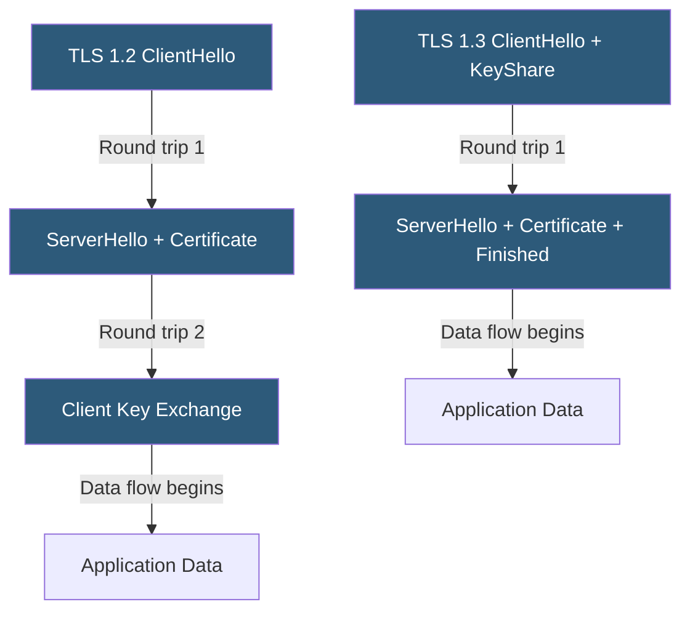

**Category:** SSL/TLS & Certificates
**Difficulty:** Intermediate
**Reading time:** 6 min read

---

TLS 1.3 (RFC 8446, 2018) modernizes TLS 1.2 by removing deprecated cryptographic algorithms, reducing the handshake to one round trip, mandating forward secrecy, and introducing 0-RTT session resumption — delivering both security improvements and measurable performance gains.

- **1-RTT Handshake** — TLS 1.3's reduced handshake requiring only one round trip before data flows
- **0-RTT Early Data** — TLS 1.3 session resumption allowing data in the first flight, with replay risk
- **Forward Secrecy** — Mandatory in TLS 1.3, ensuring session keys cannot be derived from compromised private keys
- **Removed Algorithms** — TLS 1.3 eliminates RSA key exchange, MD5, SHA-1, RC4, DES, and CBC modes
- **Key Share** — The TLS 1.3 mechanism for sending Diffie-Hellman parameters in the first `ClientHello`
- **Session Tickets** — TLS 1.2 mechanism for session resumption, replaced by PSK in TLS 1.3
- **Downgrade Protection** — TLS 1.3 random value sentinel preventing version downgrade attacks

TLS 1.2 requires two round trips to complete the handshake before the client and server can exchange application data. The client sends `ClientHello`, receives the server's certificate and key exchange parameters, verifies the certificate, sends its key exchange data, and only after the server's `Finished` message does encrypted application data begin.

TLS 1.3 compresses this by having the client include its Diffie-Hellman `KeyShare` in the initial `ClientHello`. The server, receiving both version and key share simultaneously, can compute the shared secret immediately and include `EncryptedExtensions`, its certificate, and `Finished` in a single response. The client receives everything needed to derive session keys and immediately sends application data.

In TLS 1.2, RSA key exchange allowed the server's private key to decrypt any recorded session if later compromised — a retroactive decryption risk. TLS 1.3 mandates ephemeral Diffie-Hellman for all handshakes, generating a fresh key pair per session. Compromising the server's long-term certificate cannot decrypt prior sessions.

TLS 1.3 reduces the negotiable cipher suites from dozens in TLS 1.2 to five AEAD cipher suites with only SHA-256 or SHA-384 as HKDF hash functions, dramatically reducing misconfiguration risk.

Encrypted handshake: in TLS 1.3, certificate and extension data is encrypted during the handshake, hiding server identity from network observers. TLS 1.2 transmits certificates in plaintext.

- High-traffic APIs where handshake latency contributes to p95/p99 response times
- Mobile applications on high-latency networks where RTT reduction matters
- Financial and healthcare systems requiring mandatory forward secrecy
- Servers being audited for PCI DSS or NIST TLS compliance
- Browser-facing HTTPS where 0-RTT enables instant cached page loads

| Advantage | Disadvantage |
|-----------|--------------|
| 1-RTT handshake improves latency by one full round trip | 0-RTT data is vulnerable to replay attacks |
| Mandatory forward secrecy closes retroactive decryption risk | Some load balancers and security appliances don't support TLS 1.3 |
| Encrypted certificate hides server identity from observers | Limited cipher agility may complicate compliance in regulated environments |
| Reduced cipher suite options minimize misconfiguration risk | Older TLS inspection proxies may terminate TLS 1.3 sessions |

- [SSL/TLS Protocol Versions](ssl-tls-protocol-versions.md)
- [Perfect Forward Secrecy (PFS)](perfect-forward-secrecy-pfs.md)
- [Session Resumption](session-resumption.md)

---
*Part of the [SSL/TLS & Certificates](index.md) category · [Back to Master Index](../../index.md)*
