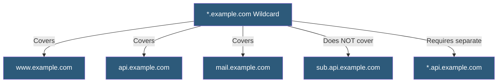

**Category:** SSL/TLS & Certificates
**Difficulty:** Intermediate
**Reading time:** 5 min read

---

Wildcard SSL certificates secure a domain and all its immediate subdomains with a single certificate using the `*.example.com` notation, reducing certificate management overhead for organizations operating many subdomains while introducing a shared private key risk.

- **Wildcard Pattern** — `*.example.com` matching any single-label subdomain (www, api, mail, etc.)
- **Single Level** — Wildcards only match one subdomain level; `*.example.com` does not cover `a.b.example.com`
- **Shared Private Key** — All wildcard-covered subdomains use the same certificate and private key
- **DNS-01 Challenge** — The required ACME validation method for automated wildcard DV certificates
- **Subject Alternative Names (SAN)** — Wildcard certificates include both `*.example.com` and `example.com` as SANs
- **Key Compromise Scope** — If the wildcard private key is stolen, all subdomains are compromised
- **Certificate Revocation** — Revoking a wildcard certificate disrupts all subdomains simultaneously

A wildcard certificate's Common Name (CN) or Subject Alternative Name contains the wildcard label `*` as the leftmost part of the hostname, matching any single DNS label in that position. The certificate issued for `*.example.com` is valid for `www.example.com`, `api.example.com`, and `app.example.com` — any first-level subdomain.

The wildcard does not recursively cover deeper levels. `api.example.com` is covered, but `v1.api.example.com` is not, and requires either a separate certificate for that subdomain or a second wildcard `*.api.example.com`.

Wildcard certificates require DNS-01 challenge validation for automated ACME issuance because HTTP-01 challenges can only prove control of specific hosts, not a wildcard pattern. DNS-01 places a `_acme-challenge.example.com` TXT record, demonstrating DNS zone control — a stronger assertion appropriate for broad coverage.

The security implication of wildcard certificates is that the private key must be distributed to every server hosting any covered subdomain. A subdomain hosted on a compromised server exposes the private key, potentially enabling impersonation or decryption of traffic across all subdomains. Certificate pinning and wildcard certificates are incompatible, since the certificate is shared.

- SaaS platforms with per-customer subdomains (customer.app.com)
- Organizational intranets with many internal subdomain services
- CDN configurations serving multiple subdomains from one certificate
- Multi-environment deployments (dev, staging, prod) under one domain
- E-commerce platforms with category or regional subdomains

| Advantage | Disadvantage |
|-----------|--------------|
| Single certificate covers unlimited immediate subdomains | Shared private key — one compromise affects all subdomains |
| Reduces certificate count and management overhead | DNS-01 validation requires DNS API access for automation |
| Works for dynamically created subdomains without reissuance | Single revocation disrupts all covered subdomains |
| Simplifies CDN configuration for subdomain-heavy architectures | Does not cover multi-level subdomains |

- [SSL Certificate Types](ssl-certificate-types.md)
- [Multi-Domain (SAN) Certificates](multi-domain-san-certificates.md)
- [Let's Encrypt Automation](lets-encrypt-automation.md)

---
*Part of the [SSL/TLS & Certificates](index.md) category · [Back to Master Index](../../index.md)*
