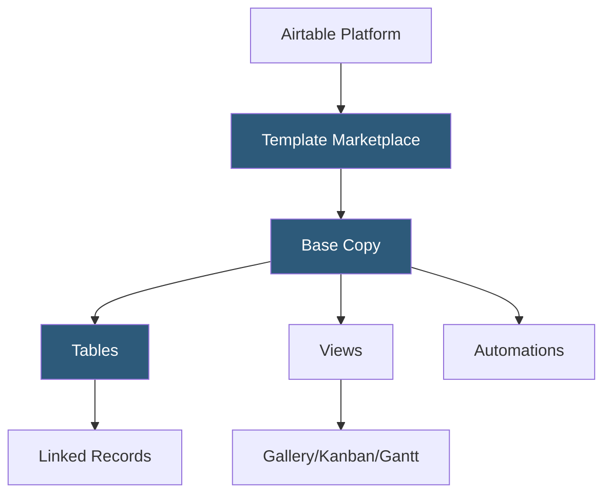

**Category:** Template Marketplaces
**Difficulty:** Beginner
**Reading time:** 5 min read

---

The Airtable Template Marketplace is Airtable's official collection of pre-built base templates covering project management, content planning, CRM, product management, and more. Templates provide immediately usable database structures with pre-configured fields, views, and automations optimized for specific team workflows.

- **Airtable Base** — the fundamental unit of Airtable, containing one or more tables with typed fields and views
- **Template Categories** — organized sections including Marketing, Product, HR, Finance, Operations, and Personal
- **Field Types** — templates use Airtable's rich field types (Single/Multi-select, Attachments, Linked Records, Formulas, Rollups)
- **Linked Records** — relational connections between tables within a base, central to complex template architectures
- **Automations** — trigger-action workflows (email notifications, record creation, Slack alerts) configured within templates
- **Interface Designer** — low-code dashboards built on top of base data, often included in advanced templates
- **Pre-built Views** — Gallery, Kanban, Calendar, Gantt, and Grid views pre-configured in templates for immediate use

Airtable templates are shared bases accessible via a template link. Clicking "Use this template" triggers a server-side base copy operation that clones the entire base structure—tables, fields with their type configurations, views with their settings and filters, and any automations—into the user's workspace. The copy is fully independent of the original template.

Linked Record fields are the architectural cornerstone of complex Airtable templates. A CRM template, for example, links a Contacts table to a Deals table, allowing each deal record to reference multiple contacts and each contact record to show a rollup of their associated deal values. Rollup and Lookup fields then aggregate or surface data across these links, creating a relational data model within Airtable's spreadsheet UI.

Automations in templates are copied with their trigger and action configurations but require re-authentication for external service steps (Gmail, Slack, Jira). Built-in automation steps like "Create Record" or "Update Record" work immediately. The Interface Designer feature allows template creators to build custom dashboards on top of base data—charts, summary cards, and filtered record lists—providing a non-technical user view separate from the raw table. These interfaces are included in template copies.

- Marketing teams managing content calendars with multi-channel campaign tracking
- Product teams coordinating roadmaps with linked feature and sprint tables
- Sales teams building lightweight CRM pipelines with email automation
- HR teams tracking hiring pipelines from job posting through onboarding
- Event planners coordinating vendors, venues, and attendees in linked tables

| Advantage | Disadvantage |
|-----------|--------------|
| Rich field types enable real relational data modeling | Automation external integrations need re-authentication post-copy |
| Interface Designer provides executive-friendly views | Advanced features (Gantt, Sync, automations) require paid plans |
| Linked Records enable cross-table data relationships | Templates with many linked tables have steep learning curves |
| Official templates demonstrate Airtable best practices | Free plan row limits constrain large-dataset templates |

- [Notion Template Gallery](notion-template-gallery.md)
- [Coda Template Gallery](coda-template-gallery.md)
- [Monday.com Template Center](monday-com-template-center.md)

---
*Part of the [Template Marketplaces](index.md) category · [Back to Master Index](../../index.md)*
