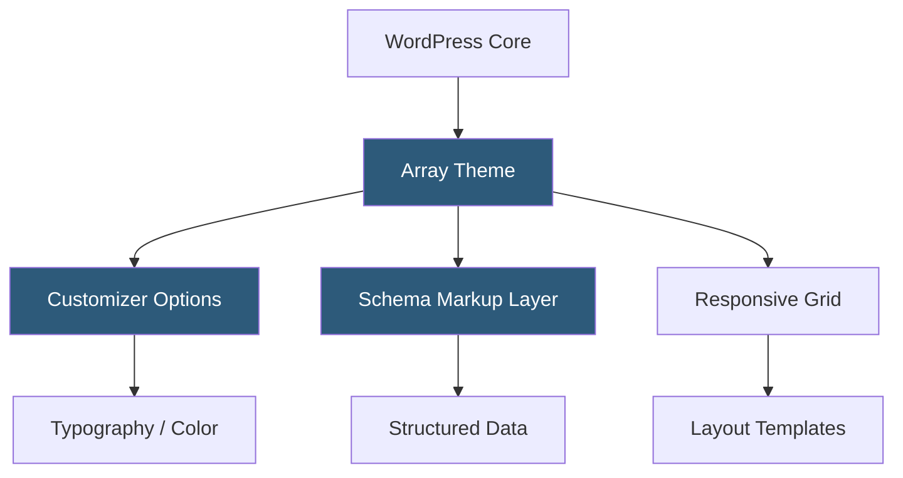

**Category:** Template Marketplaces
**Difficulty:** Beginner
**Reading time:** 5 min read

---

Array Themes is a boutique WordPress theme shop producing minimalist, typography-driven themes primarily for writers, bloggers, and publication-style sites. The studio emphasizes clean HTML structure, accessibility best practices, and adherence to WordPress coding standards over feature quantity.

- **Minimalist Design Philosophy** — themes strip UI to essentials, letting content take visual priority
- **Schema Markup** — structured data baked into theme templates for improved search engine rich results
- **Customizer-Driven Styling** — all visual customization handled through the WordPress Customizer without plugin dependencies
- **Accessibility Compliance** — keyboard navigation, ARIA labels, and color contrast standards built into base themes
- **Responsive Grid System** — flexible CSS grid layouts adapting cleanly across all viewport sizes
- **Modular Theme Options** — focused settings panels avoiding feature bloat
- **Child Theme Ready** — clean hook system designed for safe child-theme customization

Array themes follow a traditional WordPress theme architecture without companion plugins or custom post types. All functionality is delivered through standard WordPress hooks, Customizer sections, and template hierarchy files. This intentional restraint means themes load quickly—no heavy JavaScript bundles, no builder libraries, no redundant CSS frameworks.

Schema markup is output through PHP functions hooked into WordPress's `the_content` and post template actions. Article, BlogPosting, and BreadcrumbList schema types are automatically generated from WordPress post data, improving eligibility for Google rich results without requiring an SEO plugin.

The Customizer implementation uses core WordPress `add_setting()` and `add_control()` functions with JavaScript preview bindings via `wp.customize`. Typography controls typically expose font-family selection from a curated list of system and Google Fonts, with corresponding CSS output either inlined in `<head>` or written to a cached stylesheet. Color controls generate CSS custom properties that cascade through the stylesheet. The result is a theme with a small footprint, fast TTFB, and high Google Lighthouse scores out of the box.

- Personal blogs and journals prioritizing readability
- News and magazine sites where content density matters
- Author websites and book promotion pages
- Podcast show notes and long-form essay publishing
- SEO-focused content sites needing clean markup

| Advantage | Disadvantage |
|-----------|--------------|
| Extremely fast load times with minimal overhead | Limited visual variety compared to multipurpose themes |
| Accessibility-compliant out of the box | No built-in e-commerce or portfolio functionality |
| Clean markup aids SEO and future migrations | Small template library limits niche use-case coverage |
| No plugin dependencies reduce compatibility issues | Requires developer comfort for significant customizations |

- [PixelGrade WordPress Themes](pixelgrade-wordpress-themes.md)
- [Colorlib Free Themes](colorlib-free-themes.md)
- [ThemeIsle WordPress Themes](themeisle-wordpress-themes.md)

---
*Part of the [Template Marketplaces](index.md) category · [Back to Master Index](../../index.md)*
