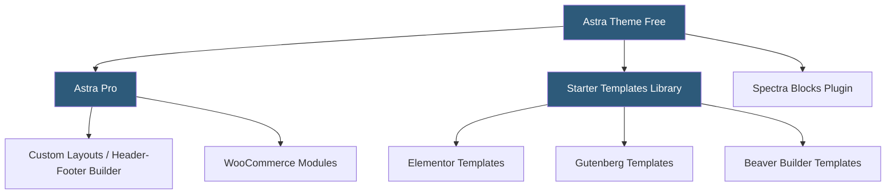

**Category:** Template Marketplaces
**Difficulty:** Beginner
**Reading time:** 6 min read

---

Astra is one of the world's most popular WordPress themes with over 1.8 million active installations, built by Brainstorm Force. It differentiates itself through an extremely lightweight core (~50KB on the front end), compatibility with all major page builders, and an extensive starter templates library accessible through a companion plugin.

- **Astra Pro** — premium upgrade adding custom layouts, header/footer builder advanced options, WooCommerce modules, and advanced typography
- **Starter Templates Plugin** — free companion plugin providing access to 250+ complete website templates importable in minutes
- **Spectra Blocks** — formerly Ultimate Addons for Gutenberg; Brainstorm Force's Gutenberg block plugin that pairs with Astra
- **Custom Layouts** — Astra Pro feature for creating custom headers, footers, and content hooks without code
- **Astra Agency Toolkit** — bundle combining Astra Pro, Spectra Pro, Convert Pro, and WP Portfolio plugins
- **Zero Bloat Philosophy** — Astra loads no jQuery on the front end by default, relying on vanilla JS for interactions
- **Page Builder Compatibility** — officially tested with Elementor, Beaver Builder, Divi, Brizy, and Gutenberg
- **Brainstorm Force Ecosystem** — parent company offering multiple complementary plugins (Convert Pro, Schema Pro, WP Portfolio)

Astra's core value proposition is performance-first architecture combined with maximum page builder flexibility. The base theme ships with minimal CSS and JavaScript, producing fast Time to First Byte and First Contentful Paint scores. Rather than including built-in design features that many users won't need, Astra delegates visual complexity to whichever page builder the user chooses.

The Starter Templates plugin connects to Brainstorm Force's cloud-hosted template library. When a user imports a starter site, the plugin detects the active page builder and downloads only the template variant built for that builder — an Elementor import pulls Elementor JSON data; a Gutenberg import fetches block patterns and post content. The import wizard handles installing required plugins, importing content via WordPress XML, setting up widgets, and configuring Customizer settings.

Astra Pro's Custom Layouts feature is among its most powerful capabilities. It allows administrators to create content using the page builder and assign it to header positions, footer positions, or inside the content loop using conditions (specific pages, post types, categories, or logged-in users). This replaces what would otherwise require custom PHP template files, making complex layout customizations accessible to non-developers.

The WooCommerce module extends Astra Pro with product page builders, off-canvas cart drawers, quick view functionality, infinite scroll for shop archives, and sticky add-to-cart bars. These are features typically requiring separate WooCommerce extension plugins, and their inclusion in Astra Pro represents genuine value consolidation.

Brainstorm Force bundles multiple products into agency toolkit pricing, creating incentives for high-volume users. The bundle combines theme, blocks, lead generation (Convert Pro), and portfolio plugin licenses under a single annual fee — rational economics for agencies managing many client sites.

- Building performance-critical WordPress sites where Core Web Vitals scores matter
- Agency workflows deploying many client sites using diverse page builders
- WooCommerce stores needing advanced product page layouts without separate plugins
- Gutenberg-first development using Spectra Blocks as the block library
- Client sites requiring custom header/footer layouts per page type via Custom Layouts

| Advantage | Disadvantage |
|-----------|--------------|
| Extremely lightweight core improves performance | Advanced features require Pro license |
| Compatible with all major page builders | Starter templates quality varies by niche coverage |
| 250+ starter templates across industries | Deep Brainstorm Force ecosystem creates vendor reliance |
| Custom Layouts replaces custom PHP template work | Free theme support limited to community forums |
| WooCommerce modules consolidate plugin costs | Some Pro modules replicate free plugin functionality |

- [GeneratePress Premium Themes](generatepress-premium-themes.md)
- [Kadence Theme Blocks](kadence-theme-blocks.md)
- [ThemeIsle WordPress Themes](themeisle-wordpress-themes.md)

---
*Part of the [Template Marketplaces](index.md) category · [Back to Master Index](../../index.md)*
