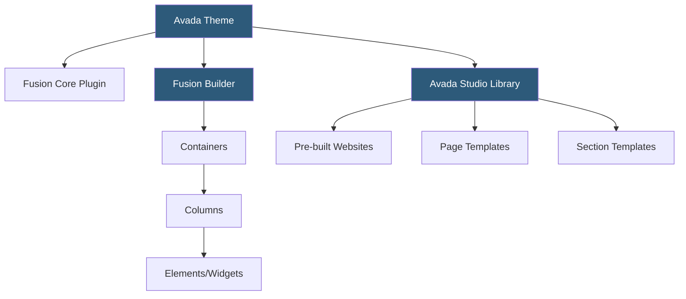

**Category:** Template Marketplaces
**Difficulty:** Intermediate
**Reading time:** 6 min read

---

Avada is the best-selling WordPress theme of all time on ThemeForest, developed by ThemeFusion. It ships with the proprietary Fusion Builder page builder, Fusion Core plugin, and an extensive library of pre-built websites. As a self-contained product, Avada includes everything needed for professional website development without third-party builder plugins.

- **Fusion Builder** — Avada's proprietary page builder using containers, columns, and elements with live visual editing
- **Fusion Core Plugin** — required companion plugin handling Avada's custom post types, shortcodes, and features
- **Avada Library** — cloud-connected library of pre-built websites, pages, and sections importable from within WordPress
- **Avada Studio** — expanded name for the library system offering community-contributed layouts
- **Global Options** — theme-wide settings controlling colors, typography, header style, and layout defaults
- **Page Options** — per-page overrides for global options enabling unique layouts on individual pages
- **Fusion White Label** — option to remove Avada/ThemeFusion branding for agency use
- **Dynamic Data** — Avada feature connecting page builder elements to WordPress meta fields, ACF, and Toolset data

Avada's architecture is the quintessential "everything included" premium WordPress theme. Where performance-first themes like GeneratePress or Astra load minimal code by default, Avada loads a comprehensive feature set on every page — the trade-off accepted by its audience in exchange for never needing additional plugins.

Fusion Builder uses a container-column-element hierarchy similar to Divi's row-column-module system. Containers are full-width sections with background options; columns divide the container horizontally; elements (called Fusion Builder Elements) are the content units — headings, images, buttons, sliders, accordions, countdown timers, pricing tables, and 75+ others. The visual editor renders changes in the browser using a front-end preview.

Avada's Global Options system is unusually comprehensive — hundreds of options controlling every visual aspect of the theme including 15+ header layouts, 6 page title bar styles, 4 footer column layouts, and granular typography controls per heading level. This breadth is both Avada's strength (extensive customization without code) and its complexity challenge (the options panel intimidates new users).

The Avada Studio library connected to a cloud service hosts hundreds of pre-built complete website designs and thousands of individual page and section templates. Unlike static demo import files, the Studio library is live — new templates are added regularly and accessible without downloading theme updates. Templates are imported directly into the Fusion Builder, allowing mixing and matching sections from different website concepts.

Dynamic Data integration allows connecting Fusion Builder elements to custom field data from Advanced Custom Fields (ACF), Toolset, or native WordPress fields. A card element can pull its title, image, and description from post meta rather than static content, enabling database-driven page layouts without custom PHP templates.

- Building feature-rich WordPress sites where all capabilities are bundled without additional plugins
- Complex multi-layout sites using per-page header and footer variations
- Agencies needing a white-label premium product for client delivery
- Data-driven page layouts connecting Fusion Builder to ACF custom fields
- Comprehensive site builds where global options manage all design variables

| Advantage | Disadvantage |
|-----------|--------------|
| All-inclusive: rarely needs additional plugins | Slow page load times from comprehensive feature loading |
| Comprehensive pre-built website library | Fusion Builder creates significant theme lock-in |
| Per-page options allow unique layouts site-wide | Large learning curve for Global Options system |
| Active development; longest-running premium theme | Proprietary builder not compatible with Gutenberg patterns |
| Dynamic Data for custom field page builder integration | Premium price higher than modern lightweight alternatives |

- [ThemeForest WordPress Themes](themeforest-wordpress-themes.md)
- [Elegant Themes Marketplace](elegant-themes-marketplace.md)
- [BeTheme Multipurpose Theme](betheme-multipurpose-theme.md)

---
*Part of the [Template Marketplaces](index.md) category · [Back to Master Index](../../index.md)*
