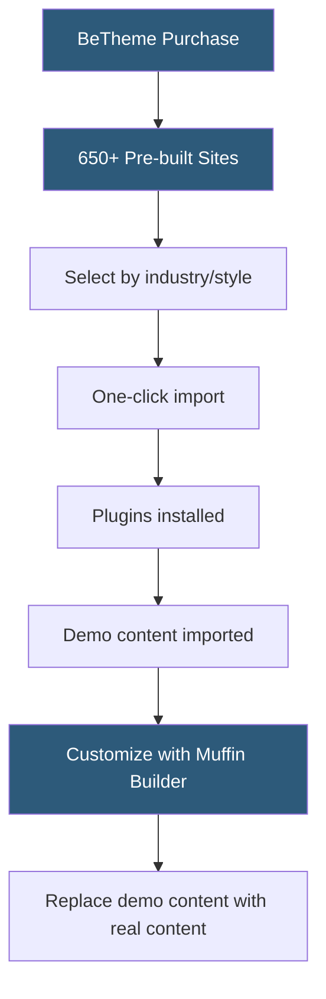

**Category:** Template Marketplaces
**Difficulty:** Intermediate
**Reading time:** 5 min read

---

BeTheme is a premium WordPress multipurpose theme sold on ThemeForest, known for its library of over 650 pre-built websites and deep integration with both WPBakery Page Builder and Muffin Builder (its own proprietary builder). It targets users who prioritize quantity of starting-point designs over builder ecosystem size.

- **Muffin Builder** — BeTheme's proprietary drag-and-drop page builder, lighter than WPBakery but with fewer third-party extensions
- **WPBakery Integration** — optional compatibility with WPBakery (formerly Visual Composer) for users already invested in that builder
- **Pre-Built Websites** — 650+ complete site designs covering virtually every commercial niche
- **Muffin Options** — BeTheme's theme options panel controlling header, footer, colors, typography, and layout globally
- **Shortcodes** — BeTheme's legacy system of text-based shortcodes for embedding elements (partially replaced by Muffin Builder)
- **Header Types** — 20+ different header layout styles selectable globally or per page
- **Retina-Ready** — high-DPI display optimization built into all graphical elements
- **Developer Friendly** — documented action hooks and filter hooks for PHP-based customization

BeTheme's primary value proposition is the sheer volume and variety of its pre-built website library. With 650+ complete site designs organized by industry (medical, legal, restaurant, agency, e-commerce, etc.) and style (minimal, creative, corporate), BeTheme attempts to cover every conceivable use case with a ready-made starting point.

The pre-built websites are imported via BeTheme's Sites Manager, accessible from the WordPress admin. Each pre-built site lists its required plugins, preview screenshots for desktop and mobile, and a compatibility indicator for Elementor vs Muffin Builder versions. Importing installs required plugins, applies content via WP importer, configures widgets, and restores Customizer settings in a sequential automated process.

Muffin Builder, BeTheme's native page builder, uses a section-based editing model. Unlike grid-based builders that require explicit row and column structures, Muffin Builder's sections contain elements in a more freeform arrangement. This can be faster for simple layouts but less precise for complex grid designs than Elementor or Divi.

The Muffin Options panel is BeTheme's global configuration system. It provides settings for the site as a whole — header style, footer columns, global font stacks, color schemes — and the same options can be overridden per-page using BeTheme's page-level options metabox. This two-tier options system allows global consistency while enabling specific pages to deviate (e.g., a full-screen landing page with no header).

BeTheme includes a "Responsive Menu" system and 20+ header styles covering top-bar layouts, side navigation patterns, centered logos, transparent overlaid headers, and mega-menu configurations. This built-in header variety reduces the need for external header builder plugins.

- Rapidly prototyping a variety of niche site concepts using pre-built designs
- Building sites for service businesses (medical, legal, real estate) with industry-specific templates
- WordPress developers who work across many client projects needing maximum layout variety
- WPBakery users who want a compatible premium theme with an extensive template library
- Creative agencies building client sites that need unique visual identities from a template starting point

| Advantage | Disadvantage |
|-----------|--------------|
| 650+ pre-built sites covers nearly every niche | Muffin Builder has smaller extension ecosystem than Elementor |
| Dual builder support (Muffin + WPBakery) | Feature density makes the theme options complex |
| 20+ header styles reduce plugin dependencies | Performance below lightweight themes with same visual results |
| One-time ThemeForest purchase with lifetime updates | Larger file size compared to minimal-framework themes |
| Developer hooks for PHP customization | Long-term support depends on single vendor |

- [Avada Theme Builder](avada-theme-builder.md)
- [ThemeForest WordPress Themes](themeforest-wordpress-themes.md)
- [Bridge Creative Theme](bridge-creative-theme.md)

---
*Part of the [Template Marketplaces](index.md) category · [Back to Master Index](../../index.md)*
