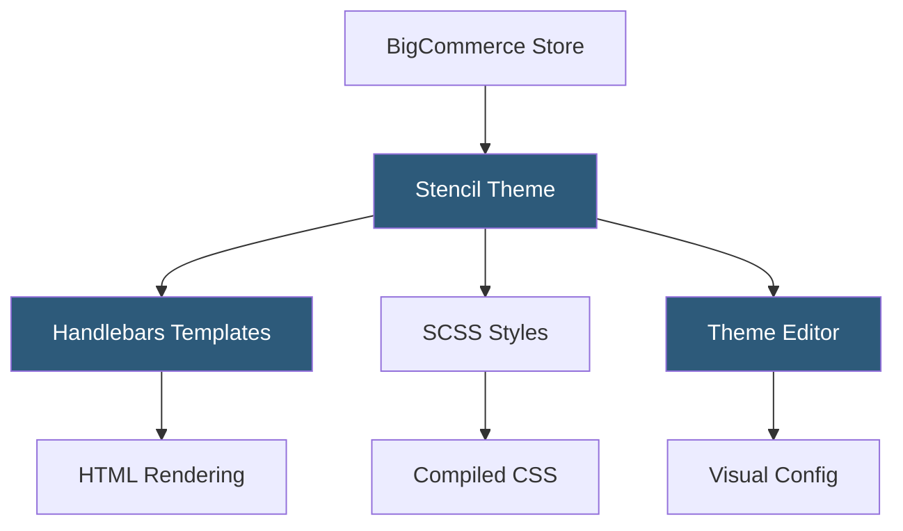

**Category:** Template Marketplaces
**Difficulty:** Intermediate
**Reading time:** 5 min read

---

The BigCommerce Theme Marketplace offers a curated collection of free and premium storefront themes for BigCommerce merchants, all built on the Stencil framework. Themes are optimized for conversion, mobile performance, and SEO, with the Cornerstone reference theme serving as the open-source foundation for all marketplace themes.

- **Stencil Framework** — BigCommerce's proprietary theme engine using Handlebars.js templates, SCSS, and JavaScript
- **Cornerstone Theme** — BigCommerce's open-source reference theme available on GitHub as a development baseline
- **BigCommerce Theme Editor** — visual drag-and-drop customization interface for colors, fonts, and layout options
- **Stencil CLI** — command-line toolchain for local theme development, preview, and deployment
- **Blueprint (Legacy)** — older BigCommerce theme framework superseded by Stencil, still supported for existing themes
- **Theme Variations** — multiple style variants within a single theme purchase (e.g., light, dark, bold)
- **Page Builder** — BigCommerce's drag-and-drop page content editor for custom landing pages within the theme

Stencil themes use Handlebars.js as the server-side templating engine. Template files reference BigCommerce's global context objects—`product`, `category`, `cart`, `customer`—which the platform populates before rendering. SCSS compiles to CSS during the Stencil CLI build process, with vendor-specific prefixes added automatically. JavaScript is bundled using webpack as part of the build pipeline.

Local development uses `stencil start`, which launches a reverse proxy pointing to a live BigCommerce store. The local server intercepts storefront requests, renders templates from the developer's filesystem, and proxies API calls to the live store backend. This enables real product data in local preview without maintaining a separate data environment.

The Theme Editor (accessed in the BigCommerce control panel) reads a `config.json` file in the theme that defines settings schemas. Merchants use sliders, color pickers, dropdowns, and toggles to adjust values that map to SCSS variables. When settings are saved, BigCommerce recompiles the CSS with the new variable values and deploys the updated stylesheet to the CDN. Theme variations are defined as named presets in `config.json` that override default setting values.

- Mid-market retailers needing enterprise-grade e-commerce themes
- B2B merchants with complex catalog and pricing requirements
- Multi-channel retailers using BigCommerce as a headless backend
- Agencies building custom storefronts using Cornerstone as a base
- International merchants needing multi-currency storefront support

| Advantage | Disadvantage |
|-----------|--------------|
| Stencil CLI enables professional local development workflow | Smaller theme marketplace than Shopify's ecosystem |
| Cornerstone open source enables full custom development | Handlebars learning curve for teams familiar with React/Vue |
| Multiple variations per theme purchase provide design flexibility | Premium theme prices can be high relative to Shopify equivalents |
| Performance-optimized by BigCommerce engineering standards | Blueprint legacy themes still in use creating ecosystem fragmentation |

- [Shopify Theme Store](shopify-theme-store.md)
- [Shopify Premium Themes](shopify-premium-themes.md)
- [Webflow Templates Marketplace](webflow-templates-marketplace.md)

---
*Part of the [Template Marketplaces](index.md) category · [Back to Master Index](../../index.md)*
