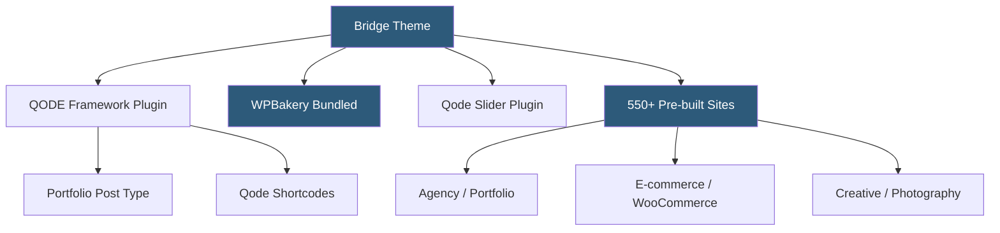

**Category:** Template Marketplaces
**Difficulty:** Intermediate
**Reading time:** 5 min read

---

Bridge is a premium WordPress creative theme by QODE Interactive, consistently one of ThemeForest's best-selling themes. It is built around the Visual Composer (WPBakery) page builder and ships with QODE's proprietary Qode Framework plugin, offering over 550 pre-built websites targeted at creative agencies, portfolios, and visual-heavy brands.

- **QODE Framework** — proprietary companion plugin adding custom page types, shortcodes, and theme settings specific to Bridge
- **Visual Composer (WPBakery)** — bundled page builder plugin included with purchase (commercial value ~$64)
- **Qode Slider** — custom slider plugin bundled with Bridge for advanced full-screen and layered slideshows
- **Portfolio Post Type** — custom post type with filterable gallery and masonry layout options
- **Bridge Options** — theme options panel offering hundreds of global settings for visual configuration
- **Revolution Slider** — optionally bundled premium slider plugin with timeline and hero section capabilities
- **Google Fonts Integration** — access to the full Google Fonts catalog with per-element typography assignment
- **Parallax Sections** — built-in parallax scrolling effect applied to section backgrounds without JavaScript plugins

Bridge's architecture centers on the QODE Framework, which extends WordPress's data model with custom post types (Portfolio, Testimonials), custom shortcodes rendered into rich HTML, and Bridge Options — a comprehensive settings interface for configuring the theme's visual output.

The bundled WPBakery page builder is the primary content composition tool. WPBakery uses rows with column grids, and each grid cell contains WPBakery elements (QODE calls them "content elements"). Bridge adds a substantial library of QODE-specific content elements to WPBakery — carousels, portfolio displays, pricing tables, countdown timers, and animated service boxes — effectively making WPBakery a vehicle for QODE's proprietary component library.

Pre-built website imports in Bridge use a one-click import mechanism that downloads and applies XML content data, widget settings, and Bridge Options configuration. The library of 550+ sites includes a broad range across creative industries: architecture firms, design agencies, photography studios, music acts, restaurants, fashion brands, and corporate services. Most designs use full-width layouts, bold typography, and heavily parallax-scrolled sections typical of the creative theme aesthetic.

The Portfolio system supports multiple display styles — masonry, grid, Pinterest-style variable-height, and carousel — with filterable category tabs. This makes Bridge popular for agencies and creative professionals who need to showcase case studies or portfolio work prominently.

Bridge's parallax implementation applies CSS `background-attachment: fixed` enhanced with JavaScript-driven transform animations for cross-browser compatibility and smooth scroll performance. Background videos in sections are another frequently used visual technique in Bridge templates, supported natively without additional plugins.

- Creative agencies showcasing portfolio work with visual impact
- Photography, videography, and design studios needing media-heavy templates
- Brands prioritizing bold visual storytelling over content-heavy layouts
- WooCommerce fashion or lifestyle brands wanting visually premium storefronts
- Professionals building presentation-quality online portfolios with filterable work galleries

| Advantage | Disadvantage |
|-----------|--------------|
| Bundled WPBakery and Qode Slider add commercial value | Heavy page weight from bundled plugins and visual effects |
| Extensive creative template library for visual niches | Strong visual style creates recognizable "Bridge look" |
| Advanced parallax and video backgrounds built-in | WPBakery creates layout lock-in if migrating |
| Portfolio post type purpose-built for creative work | QODE Framework creates dependency outside WordPress ecosystem |
| Regular updates maintained by QODE Interactive | Complex options panel steep learning curve |

- [BeTheme Multipurpose Theme](betheme-multipurpose-theme.md)
- [Avada Theme Builder](avada-theme-builder.md)
- [ThemeForest WordPress Themes](themeforest-wordpress-themes.md)

---
*Part of the [Template Marketplaces](index.md) category · [Back to Master Index](../../index.md)*
