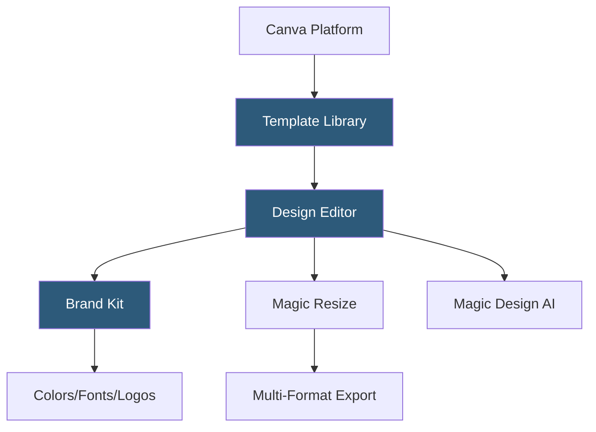

**Category:** Template Marketplaces
**Difficulty:** Beginner
**Reading time:** 5 min read

---

The Canva Template Library is Canva's extensive collection of millions of professionally designed templates for social media graphics, presentations, documents, marketing materials, and videos. Templates are edited directly within Canva's browser-based design tool and are accessible to both free and Pro users, with premium templates gated behind Canva Pro.

- **Template Categories** — 100+ format categories including Instagram posts, presentations, resumes, flyers, logos, and video
- **Brand Kit Integration** — Canva Pro feature applying company colors, fonts, and logos to templates instantly
- **Magic Resize** — one-click template resizing to fit different platform dimensions from a single source design
- **Content Credentials** — metadata embedded in downloads indicating AI involvement in design creation
- **Canva for Teams** — shared template libraries allowing organizations to distribute brand-consistent templates
- **Canva Pro vs Free Templates** — free templates require no subscription; Pro templates require Canva Pro with crown icon
- **AI-Generated Templates** — Canva's Magic Design feature generating custom templates from text prompts

Canva templates are stored as Canva design documents in a proprietary format on Canva's servers. When a user selects a template, it creates a copy of the design document linked to their account. The design editor renders the document as an interactive canvas where every element—text boxes, images, shapes, backgrounds—is a layer object with position, size, and style properties editable through sidebar panels.

Brand Kit integration works by replacing template placeholder styles with user-defined brand values. When "Apply Brand Kit" is triggered, Canva's style-matching algorithm substitutes the template's primary, secondary, and accent colors with the corresponding Brand Kit colors, and swaps font families to match the Kit's heading and body font selections. The substitution uses nearest-match logic based on color role (dark/light/accent) rather than exact hex matching.

Magic Resize generates derivative designs by re-calculating element positions and sizes relative to the new canvas dimensions. Text scaling uses a combination of font size reduction and text reflow, while image crops are adjusted using smart crop heuristics to keep faces and focal points visible. AI-generated templates from Magic Design work by taking a user's text prompt, selecting matching design elements from Canva's asset library, and assembling them in a compositionally coherent layout using trained layout models.

- Small business owners creating social media content without a designer
- Marketing teams producing consistent branded materials at scale
- Non-profit organizations building fundraising and awareness materials
- Educators creating presentation decks and classroom handouts
- Freelancers quickly turning around client-facing design deliverables

| Advantage | Disadvantage |
|-----------|--------------|
| Millions of templates reduce design time dramatically | Canva format not natively exportable to other design tools |
| Brand Kit enables non-designers to maintain brand consistency | Heavy use of similar templates can make designs feel generic |
| Magic Resize eliminates manual reformatting for multi-platform publishing | Advanced typography and design control limited vs professional tools |
| Free tier is genuinely useful for basic design needs | Certain premium elements within free templates require Pro upgrade |

- [Creative Market Templates](creative-market-templates.md)
- [Envato Elements Subscription](envato-elements-subscription.md)
- [Webflow Templates Marketplace](webflow-templates-marketplace.md)

---
*Part of the [Template Marketplaces](index.md) category · [Back to Master Index](../../index.md)*
