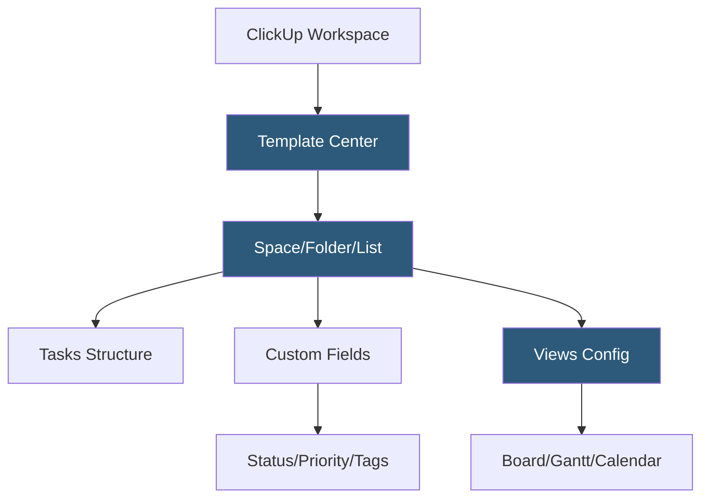

**Category:** Template Marketplaces
**Difficulty:** Beginner
**Reading time:** 5 min read

---

The ClickUp Template Center is ClickUp's built-in marketplace of thousands of workspace templates covering project management, CRM, software development, marketing, HR, and personal productivity. Templates are applied directly within the ClickUp workspace, creating complete Space, Folder, or List structures with pre-configured tasks, custom fields, views, and automations.

- **Workspace Hierarchy Templates** — templates targeting ClickUp's Space, Folder, or List levels depending on scope
- **Custom Fields** — typed metadata fields pre-configured in templates for statuses, priorities, estimated effort, and more
- **Views** — multiple pre-set view types (List, Board, Calendar, Gantt, Workload, Table) configured per template purpose
- **ClickApps** — feature modules (Time Tracking, Sprints, Goals, Milestones) pre-enabled in relevant templates
- **Automations** — trigger-action workflows included in templates for task routing, status notifications, and due-date reminders
- **Template Sharing** — users can save any workspace configuration as a shareable template for team reuse
- **Template Browse Filters** — category and use-case filters within the template center for discovery

ClickUp templates are serialized workspace configurations stored server-side. When applied, ClickUp's API creates the corresponding hierarchy structure—Spaces contain Folders which contain Lists which contain Tasks—with all field definitions, view settings, and automation rules instantiated. Templates applied at the Space level create the most complete setups, while List-level templates are lighter and suitable for single workflows.

Custom Fields are the primary data architecture layer in ClickUp templates. A software sprint template defines fields like Story Points (number), Assignee (person), Sprint (dropdown), and Priority (dropdown) with standardized options already configured. Statuses are defined per List and are included in template copies, ensuring teams don't have to manually recreate the status pipeline (Backlog → In Progress → Review → Done).

ClickUp Automations in templates define workflow logic: "When Status changes to Done, move task to Completed folder" or "When due date passes and Status is not Done, send Slack notification." Automation steps involving external services require the user to connect their own integrations after applying the template. The Template Center includes both official ClickUp-created templates and user-submitted community templates, with filtering by category, industry, and ClickUp plan compatibility.

- Agile software teams running sprints with backlog, sprint board, and velocity tracking
- Marketing agencies managing client campaigns across multiple deliverable types
- Remote teams standardizing onboarding workflows for new employees
- Sales teams implementing CRM pipelines with activity tracking and follow-up automation
- Product managers coordinating roadmaps with linked features, bugs, and releases

| Advantage | Disadvantage |
|-----------|--------------|
| Hierarchical templates capture complete workspace setups | External automation integrations require reconfiguration |
| Large community template library covers niche workflows | Template quality varies significantly in community submissions |
| In-app template browser reduces setup friction | Complex templates with many custom fields can overwhelm new users |
| Custom Field templates enforce data consistency across teams | Some advanced features (custom automations) require paid plans |

- [Notion Template Gallery](notion-template-gallery.md)
- [Monday.com Template Center](monday-com-template-center.md)
- [Trello Template Gallery](trello-template-gallery.md)

---
*Part of the [Template Marketplaces](index.md) category · [Back to Master Index](../../index.md)*
